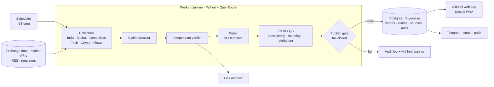
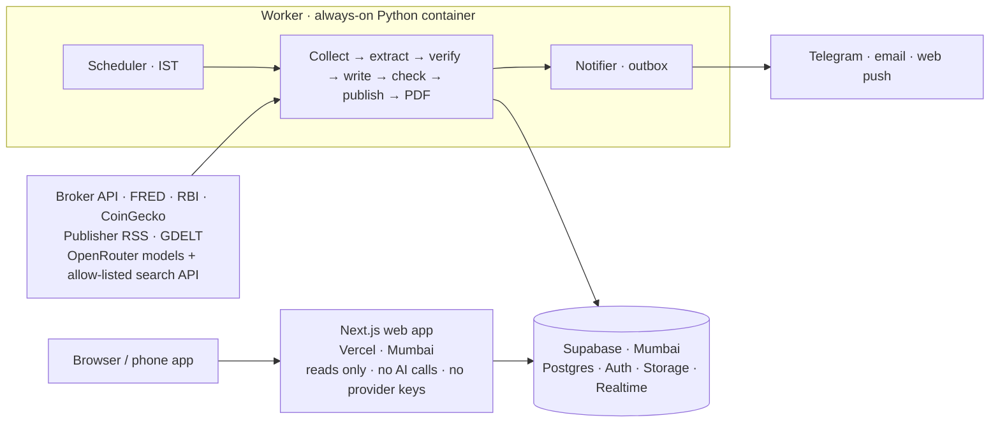
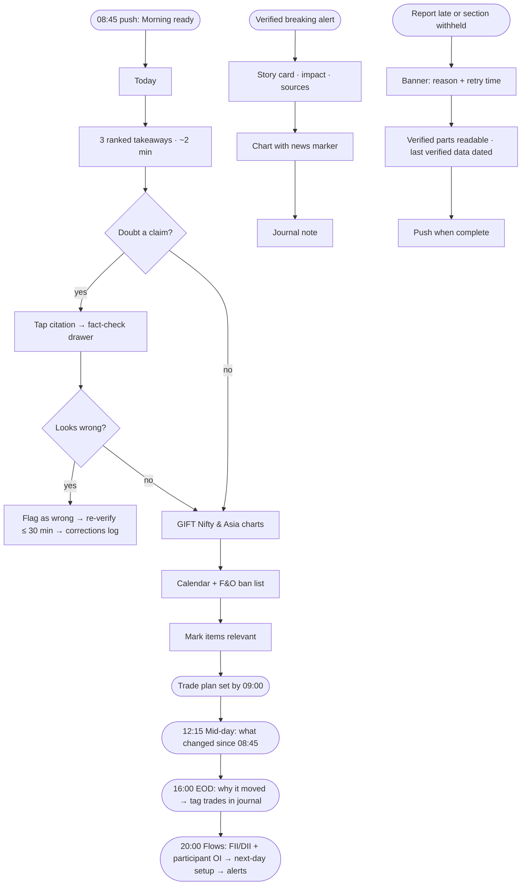

# Citebell: Product Requirements Document

**Verified before the bell.**

| | |
|---|---|
| Version | v1.4, approved for the V0 build (records the V0 decisions in the Appendix) |
| Date | 14 Sep 2026 |
| Product | Citebell (working name was "Market Intel Console") |
| Audience | Personal use first; SaaS-ready by design |
| Visual version | [`prd.html`](prd.html) has the hi-fi clickable wireframes. Download it and open it in a browser. |

> Wireframe figures, headlines and tickers are illustrative sample data, not real market information. Citebell provides market information, not investment advice.

---

## Contents
1. [Business context & objective](#1-business-context--objective)
2. [Problems the user faces](#2-problems-the-user-faces)
3. [Competitors and their key features](#3-competitors-and-their-key-features)
4. [How Citebell is different](#4-how-citebell-is-different)
5. [Brand: name & identity](#5-brand-name--identity)
6. [Features to copy from competitors](#6-features-to-copy-from-competitors)
7. [High-level solution](#7-high-level-solution)
8. [Technical architecture decisions](#8-technical-architecture-decisions)
9. [Budget and pricing](#9-budget-and-pricing)
10. [Phasing: V0 → Nirvana](#10-phasing-v0--nirvana)
11. [What else makes it holistic](#11-what-else-makes-it-a-holistic-platform)
12. [User flows](#12-user-flows)
13. [Market-ready UX](#13-market-ready-ux)
14. [High-fidelity wireframes](#14-high-fidelity-wireframes)
15. [Success metrics](#15-success-metrics)
16. [Guardrail metrics](#16-guardrail-metrics)
- [Appendix: risks, assumptions, open questions, sources](#appendix)

---

## The trading day in IST (September timings)

| Session | IST |
|---|---|
| Tokyo | 05:30–12:00 |
| Hong Kong | 07:00–13:30 |
| NSE / BSE | pre-open 09:00, regular 09:15–15:30 |
| London | 12:30–21:00 |
| New York | 19:00–01:30 |
| **Citebell drops** | **08:45 · 12:15 · 16:00 · 20:00** |

After the clocks change (UK 25 Oct, US 1 Nov 2026), London and New York start and end one hour later in IST.

---

## 1. Business context & objective

**The user** is a solo Indian F&O trader (Nifty and Bank Nifty index options, plus stock F&O). Their decisions cluster at the pre-open (09:00–09:08 order entry) and the 09:15 open. Trades are rechecked around midday and reviewed after the 15:30 close.

**What moves their book:** overnight US and Asia sessions, GIFT Nifty, crude, USD/INR, DXY, US yields, FII/DII flows, OI, PCR and max pain, India VIX, the F&O ban list, scheduled events (RBI, Fed, CPI, results), geopolitics (shipping lanes, sanctions, conflict, tariffs), tech news (AI capex and semiconductors feed Nasdaq, which feeds Nifty IT), and Bitcoin as a gauge of risk appetite.

**Objective:** one trusted source for every trading decision. Four on-time, fact-checked reports each trading day, cross-market charts, and a citation on every claim. The trader stops researching and spends that time deciding.

**Business objective (later):** prove the verification engine on one demanding user, then package it as a subscription for Indian retail F&O traders and investors. The paid promise is trust.

| Goal | Target | Why it matters |
|---|---|---|
| Pre-market research time | ≤ 15 min | Frees the 08:45–09:15 window for decisions |
| Claims with a working citation | 100% | The product's core promise |
| Unverified claims published | 0 | One wrong number costs more trust than ten right ones earn |
| Reports delivered on time | ≥ 98% | A late morning report is a useless morning report |

**Non-goals:** placing orders; buy/sell calls or price targets in Citebell's own voice (third-party views appear only with attribution); tick-level data for scalping; social media as a source.

## 2. Problems the user faces

| # | Problem | What it looks like today | Cost |
|---|---|---|---|
| P1 | Too many sources | 10+ tabs: Moneycontrol, Mint, Business Standard, Reuters, CNBC, NSE, NSDL, Investing.com, TradingView, X | An estimated 60–90 min before the open *(assumption; measure in V0)* |
| P2 | Fact-checking is manual | Provisional vs final FII data, Brent front-month vs next-month, old articles resurfacing, rumours on X and Telegram | Wrong inputs lead to wrong positions |
| P3 | Hand-built reports drift | Seen in the sample reports reviewed for this PRD: a file suffixed `_Corrected`; Brent given as $108.31, "$108" and "near $109" within one morning report; a typo in a July brief | Rework and lost trust |
| P4 | Synthesis is hard | The same story appears in eight outlets; turning it into "what does this mean for Nifty and Bank Nifty" is manual | Mental load right at 09:00 |
| P5 | Unclear freshness | It's often unclear what "as of" time a number refers to | Decisions made on stale data |
| P6 | Tight timing | US close is 01:30 IST, Tokyo opens 05:30, Hong Kong 07:00, and the report is due 08:45 | No room for a slow workflow |
| P7 | Missed events | Ban list, expiry calendar, SEBI circulars, results, macro data releases | Surprise risk on open positions |
| P8 | Charts live in other apps | No single cross-asset view | Correlations go unnoticed |
| P9 | Paywalls | Mint, Business Standard, FT, Bloomberg | Only part of a story gets read |
| P10 | No memory | No record of how a story evolved, or which news came before a win or a loss | No learning loop |

## 3. Competitors and their key features

Features and prices were checked by web search on 14 Sep 2026. Prices come from third-party reviews and may be out of date; verify before relying on them.

| Product | Key features | Gaps for this trader | Indicative price |
|---|---|---|---|
| Moneycontrol app + Pro | News, FII/DII data, results, alerts, portfolio tracking, analyst trade ideas | Ad-heavy; no claim-level citations; mostly India; promotional content mixed in | Pro ~₹699/yr [R1] |
| Mint · Business Standard · ET | Quality reporting, explainers, live market blogs | One outlet's view each; paywalls; no synthesis across sources | Subscriptions |
| Zerodha Pulse | Last 24 h of business news from major Indian outlets in one feed; related stories grouped; web, apps and browser extension | Headlines only; no verification; little global or crypto depth; no charts | Free [R2] |
| Perplexity Finance | Live NSE/BSE prices, market summaries with citations, watchlists, earnings-call transcripts, SEBI filing summaries | On demand, not scheduled; no fixed F&O report format; no flows or OI view | Free tier [R3] |
| Bloomberg Terminal · LSEG Workspace | Fast verified wire news (Reuters inside Workspace), urgency flags, calendars with consensus, deep data | Built for institutions; far beyond a personal budget; no personal synthesis | Enterprise [R5] |
| TradingView | Best-in-class charts, multi-asset coverage, alerts, watchlists; open-source Lightweight Charts (Apache-2.0) | News is secondary; no verification | Free + paid tiers [R6] |
| Koyfin | Custom dashboards; macro, FX, yields and crypto; news; transcripts | US-centric; weak India F&O coverage | Pro ~$69–109/mo [R7] |
| Benzinga Pro | Real-time newsfeed, audio squawk, scanners, calendars | US equities focus; expensive for an Indian retail trader | ~$99–197/mo, reviews differ [R8] |
| Sensibull · Opstra | Option chain, OI, PCR, Greeks, IV, strategy builders, backtesting (Opstra) | Options analytics tools, not news products | Free + paid [R4] |
| StockEdge · Trendlyne | Daily scans, FII/DII data, screeners, fundamentals | Thin on news and synthesis | Free + paid [R9] |
| Investing.com | Global quotes; economic calendar with importance stars and actual / forecast / previous columns | Ads; uneven source quality | Free + paid [R10] |
| AI-native newcomers (Tradar, MarketsEasy) | AI pre-market briefs, scored alerts, live option chain and OI with news | Accuracy unproven; sourcing opaque | Varies [R11] |

## 4. How Citebell is different

Every competitor either has trust without synthesis (wires, terminals) or synthesis without proof (apps, AI summaries). Citebell's position is **synthesis with proof, delivered at fixed times in the trading day.**

1. **Verification-first.** Each claim goes through source tiers, corroboration, a numeric check, a recency check and a publish gate. Anything unverified never appears.
2. **Citations that show their work.** Every citation carries a link, publisher, timestamp, matched quote, source tier, a Wayback Machine capture and a content fingerprint.
3. **Figures come from data, not articles.** Figures come from exchange and primary feeds and are checked against a second feed. A number has one value everywhere in a report (fixes P3).
4. **Written for F&O.** Each story is tagged with the index or sector it affects, likely direction and time horizon, plus a one-line cause → effect.
5. **Built around the trading day.** Four fixed drops in IST, each opening with what changed since the last report.
6. **Global → India transmission map.** Nasdaq semis → Nifty IT; crude → OMCs, paints, aviation; DXY → INR → FII flows; BTC → risk appetite.
7. **Learns with the trader.** Story timelines, a trade journal that links news to trades, and descriptive pattern statistics (never signals).
8. **Public corrections log.** No ads, no paid placements, no unattributed tips.

## 5. Brand: name & identity

### Recommendation: **Citebell**, tagline *"Verified before the bell."*

- **Meaning.** *Cite* is the product's promise: every claim cited. *Bell* is the market's opening bell and the four scheduled drops.
- **Sound.** Two short syllables, easy to say in English and Hindi. It works as a verb: "Citebell it before you trade."
- **Room to grow.** Not tied to F&O or India. It stretches to equities, crypto and global investors (Citebell Pro, Citebell Desk).
- **Availability.** `.com`, `.app`, `.in`, `.ai` and `.io` were all unregistered at check time; a web search found no company or product using the name.
- **Risk to manage.** "Cite" sounds like "site" and "sight". The logo and exact-match domains carry the spelling.
- **Brand device.** The `[1]` citation marker in the wordmark is the same marker that appears on every claim in the product.

### Name screen

About 80 candidates were generated. Domains were checked via registry RDAP lookups on 14 Sep 2026 (Verisign for .com, Google Registry for .app, NIXI for .in, Identity Digital for .ai and .io). Each lookup was validated against a known-registered domain and a random unregistered one.

| Name | Idea | .com | .app | .in | .ai | .io | Verdict |
|---|---|---|---|---|---|---|---|
| **Citebell** | Cited, delivered on the bell | free | free | free | free | free | **Recommended** |
| Bellproof | Proof before the bell | free | free | free | free | free | Runner-up; can read as "resistant to bells" |
| Groundtick | Ground truth, tick by tick | free | free | free | free | free | Less intuitive; "tick" also means the insect |
| Citetick | A cited tick | free | free | free | free | free | Dropped: too close to TickTick |
| Veracle | Vera (truth) + oracle | taken | free | free | free | — | No .com; "oracle" trademark risk |
| Tapeproof | Proof for the market tape | taken | free | free | free | — | No .com |
| Tickproof | A proven tick | taken | free | free | free | — | No .com; sounds like tick repellent |
| Pramaan · Tathya · Pramana | Hindi/Sanskrit for proof and fact | taken | taken | taken | taken | — | Every domain taken |
| Openbell · Firstbell | The opening bell | taken | taken | taken | taken | — | Every domain taken |

**Before announcing the name:** register all five Citebell domains together ("unregistered" doesn't rule out premium pricing); run a formal trademark search on IP India (classes 9, 36, 41, 42) and on USPTO/WIPO; check social handles, which weren't part of this screen.

### Identity system

Built from the ui-ux-pro-max design-system output for a financial dashboard (data-dense, dark-first, trust blue with amber highlights, Fira pairing), then refined for this brand. See [`design-system/citebell/MASTER.md`](../design-system/citebell/MASTER.md).

| Token | Dark | Light | Use |
|---|---|---|---|
| Ink navy | `#0A1120` | `#F3F5F9` (ground) | Background |
| Bell brass | `#EAAB45` | `#8F5B08` | Brand, citations, as-of chips |
| Signal blue | `#6AA3FF` | `#1F4FD1` | Interactive, primary |
| Advance | `#34C28E` | `#0B7A55` | Up, verified |
| Decline | `#F4697A` | `#BD2A40` | Down |
| Withheld | `#EE8B57` | `#A64B16` | Stale, withheld |

- **Type:** Fira Sans for display and UI (600–700 for headlines, 400 for body); Fira Code for tickers, prices, timestamps and citation marks, with tabular figures. ₹ amounts use Indian digit grouping (₹1,23,456 Cr).
- **Voice, do:** "Brent $96.20, up 1.4% since the NSE close [1][2] · ICE, 08:12 IST." Views are always attributed and linked.
- **Voice, don't:** "Oil is exploding, sell OMCs now!" No number without an as-of time, no hype words, no emoji, no buy/sell calls in Citebell's own voice.

## 6. Features to copy from competitors

| Feature | Borrowed from | How Citebell uses it | Phase |
|---|---|---|---|
| Multi-source aggregation, grouped stories | Zerodha Pulse | A story cluster shows "+5 similar"; syndicated copies are merged and counted as one source | V1 |
| Inline citations; Q&A over news; filing and call summaries | Perplexity Finance | A citation on every claim; Ask Citebell answers only from the verified corpus | V0 / V2 |
| Urgency levels; calendar with consensus | Bloomberg, LSEG | Flash / Breaking / Update tags; actual, consensus and prior values | V1 |
| Interactive charts, compare, alerts, watchlists | TradingView | Lightweight Charts (with attribution); percent-compare overlay; price alerts | V0 / V1 |
| Configurable dashboards; macro panel | Koyfin | Rearrangeable widgets; yields, DXY and commodities panel | V2 |
| Audio squawk; real-time alerts | Benzinga Pro | 2-minute audio morning brief; verified breaking alerts only | V2 |
| FII/DII history; ban list; results calendar; buildup scans | Moneycontrol, StockEdge, Trendlyne | Flows tab; ban-list chip in the Today rail; long/short buildup lists | V0 / V1 |
| OI, PCR, max pain, IV, VIX | Sensibull, Opstra | Display-only derivatives panel | V1 |
| Event importance stars; holiday calendars | Investing.com | 1–3 importance levels with text labels; NSE, US and Asia holidays | V1 |
| Crypto market panel | CoinGecko-style trackers | BTC/ETH, dominance, spot ETF flows, funding rates | V1 |

## 7. High-level solution

### Architecture

### Verification pipeline

1. **Extract:** split the draft into atomic claims (number, event, forecast or opinion).
2. **Tier sources:** T1 primary (exchange, regulator, central bank, government statistics, company filing) · T2 established press and wires · T3 context only · TX never publishable (social media, Telegram, unnamed).
3. **Corroborate:** find independent support. Syndicated PTI or Reuters copies count as one source.
4. **Reconcile numbers:** match against T1 data or a second feed within tolerance.
5. **Check links:** HTTP 200, the claim text is on the page, publish time captured, Wayback capture requested.
6. **Check recency:** reject stale or resurfaced stories; stamp every number with its as-of time.
7. **Gate:** pass → publish with a badge; fail → withhold and log.

| Claim type | Rule to publish | Badge |
|---|---|---|
| Market number | Matches T1 data, or two independent feeds agree within tolerance (index ±0.01%, flows exact to ₹0.01 Cr); always shows an as-of time | Primary data |
| Market number with no primary feed (V0) | Two independent T2 news reports agree within tolerance, with both times shown; replaced by a data feed in V1 (§8.4) | News-reported |
| News event | One T1 source, or two independent T2 sources | Verified · N sources |
| Forecast / opinion | Attributed to its author ("Brokerage X expects…") with a link; never in Citebell's voice | Attributed view |
| Fails any rule | Left out and written to the audit log. If a whole section misses its deadline, a banner shows the reason and retry time | Withheld |

### Report schedule

Report fields follow the structure of the sample reports reviewed for this PRD.

| Report | Cutoff → ready | Contents |
|---|---|---|
| Morning Insights | 08:15 → **08:45** | **Global opening check:** GIFT Nifty, S&P and Nasdaq futures, US close, Asia. **India setup & flows:** previous Nifty, Bank Nifty and VIX close; commodities; FII/DII; USD/INR; futures premium. **Data outlook:** PCR, put base and call wall, max pain, expiry, long/short buildup, F&O ban. Also: key takeaway; opening cue, support and key risk; overnight global news, domestic triggers, geopolitics, tech, crypto; today's calendar |
| Mid-day Markets | 11:50 → **12:15** | Main intraday driver and tone; Nifty, Sensex, Bank Nifty, VIX; breadth; sector and stock leaders; cross-asset check (WTI, Brent, gold, silver, DXY, USD/INR); news since 08:45; what changed since the morning; Europe pre-open |
| End-of-day Insights | 15:35 → **16:00** | Market story and close badge; session in one line; three drivers, ranked and cited; sector heat map; breadth; closing OI and PCR snapshot; VIX; market lesson; Europe and US futures; tomorrow's calendar |
| Institutional Flows | exchange release → **20:00** | FII/FPI and DII buy, sell and net; combined flow; 20-day trend; participant-wise OI (FII index futures long/short); NSDL FPI data (T+1); bulk and block deals; insider trades; plain-language explanation; next-day setup; US pre-market and crypto check |

### Charts (Markets tab)

- **India:** Nifty 50, Sensex, Bank Nifty, Fin Nifty, India VIX, GIFT Nifty
- **US:** S&P 500, Nasdaq, Dow, VIX, US 10Y
- **Europe:** FTSE 100, DAX, CAC 40
- **Asia:** Nikkei 225, Hang Seng, Shanghai, Kospi, TAIEX
- **Macro:** DXY, USD/INR, Brent, WTI, gold, silver, copper, India 10Y
- **Crypto:** BTC, ETH, BTC dominance
- **Features:** 1D/5D/1M/3M/1Y, % compare overlay (indexed to 100, one axis), 30-day correlation grid, world market clock

### Data & stack

- **India data:** a broker API (Upstox, Kite or Dhan) for indices, VIX, option chain, and India-traded USD/INR, gold and crude. NSE-published reports (FII/DII, participant OI, ban list, bhavcopy) only via NSE's consent, a licensed vendor or manual download. NSDL FPI data; SEBI, RBI and PIB circulars; exchange announcements. Details in §8.4.
- **Global data:** FRED, US Treasury, Fed, ECB, BoJ, PBoC and US BLS (free, official). Live global indices and commodity futures: news-reported in V0, then one paid feed (e.g. EODHD) in V1. Crypto: CoinGecko Demo API plus a public exchange price.
- **News feeds:** RSS and official feeds from Moneycontrol, Livemint, Business Standard, Economic Times, BusinessLine, CNBC-TV18, Morningstar, CNBC, Nikkei Asia, SCMP, TechCrunch, The Verge, CoinDesk, The Block. Reuters, AP, Bloomberg, FT and WSJ through web search limited to those sites (Reuters has no public RSS).
- **Stack:** Next.js + Tailwind web app on Vercel · Python worker on Railway · Supabase (Postgres, Auth, Storage, Realtime) · AI models through OpenRouter, chosen per step by a bake-off (§8.12) · Telegram bot + email. Store headlines, links and quotes of 25 words or fewer; never full articles. Reasoning in §8.

## 8. Technical architecture decisions

The twelve decisions the build depends on. Each one gives the recommendation, the reason, and what changes by phase. Prices and limits were checked on 14 Sep 2026; check them again before buying anything.

| # | Question | Decision |
|---|---|---|
| 8.1 | Separate frontend and backend? | Yes. Three parts in one repo: a Next.js web app that only reads and displays, a Python worker that does all fetching and AI work, and Supabase for data and accounts. |
| 8.2 | LangChain / Python? | No LangChain. Python for the worker, calling AI models through OpenRouter; TypeScript for the web app. |
| 8.3 | APIs or MCP? | Direct APIs wherever a number or fact enters the system. MCP for exploring data while building, and later for Ask Citebell and outside access. |
| 8.4 | Free or paid data? | V0 can run for ₹0–500 a month with the same correctness, because accuracy comes from primary sources and cross-checks. Two gaps: live global prices, and NSE-only reports that need NSE's permission or a licence. |
| 8.5 | Sign-in / sign-out | Supabase Auth from V0: magic link or Google, authenticator-app 2FA, owner-only allowlist. Roles, plans and billing arrive in V3. |
| 8.6 | Downloads | Report PDFs and a citation pack from V0; data CSVs and a calendar feed in V1; journal and account export later. |
| 8.7 | Alerts | Telegram and email in V0, web push in V1, WhatsApp only if needed (paid per message). Only verified content triggers an alert. |
| 8.8 | Build on stored data? | Yes, from day one: store time-stamped facts and claims, not just finished reports. Trends in V1, patterns in V2–V3; no buy/sell recommendations. |
| 8.9 | Caching / RAG | Caching from V0 (data, prompts, pages). No RAG in V0–V1; database search instead. RAG over verified claims comes with Ask Citebell in V2. |
| 8.10 | Eval suites | Seven suites (UX, code, data sanity, data quality, AI pipeline, system stability, cost), run in CI and in a nightly replay of past days. |
| 8.11 | Low latency and scale | Precompute, then serve: nobody waits on an AI call. Mumbai hosting, finished pages, and each report computed once no matter how many users read it. |
| 8.12 | Which model? | Chosen by a bake-off on OpenRouter across budget, mid and strong models (Gemini 2.5 Flash included), scored on accuracy, judgement, speed and cost. The model never produces numbers. Expected monthly cost drops from ~US$85–100 to ~US$10–35. |

### Deployment at a glance

### 8.1 Should frontend and backend be separate?

**Decision: yes, split by job rather than into many small services.** The web app only reads and displays. All fetching, AI calls and publishing happen in a separate worker.

| Part | Runs on | Does | Never does |
|---|---|---|---|
| Web app (Next.js + Tailwind) | Vercel | Renders pages from the database; manages sessions; saves your flags, notes and settings | Call AI models or data providers; hold their keys |
| Worker (Python) | Railway (your existing account), always on | Schedules and runs report jobs: fetch, verify, write, render PDFs, send alerts | Serve web pages |
| Supabase | Managed service, Mumbai region | Postgres database, sign-in, file storage, live updates | Business logic beyond per-user access rules |

- **Different speeds.** A report run takes minutes; a page must load in milliseconds. Web hosting functions time out on long jobs.
- **Safer keys.** OpenRouter, broker and data keys live only in the worker, so a web-app bug can't expose them.
- **Separate scaling.** More users add web load; more reports add worker load.
- **One contract.** The database schema, plus data shapes defined once in Python and generated as TypeScript types for the web app.
- **Not GitHub Actions for scheduling.** GitHub's docs say scheduled workflows can be delayed under heavy load and some queued jobs dropped [R16], which is too risky for an 08:45 deadline. A monitor alerts you if a run doesn't check in on time.

Repo layout: `apps/web` · `apps/worker` · `packages/schemas` · `evals/` · `infra/`.

### 8.2 Do we need LangChain or Python?

**Decision: no LangChain or LangGraph. Python for the worker, calling AI models through OpenRouter with a standard OpenAI-compatible client; TypeScript for the web app.**

Why no LangChain:
- The pipeline is a fixed sequence (collect → extract → verify → write → check → publish), not an open-ended agent. Plain code is easier to test, re-run and debug.
- Each step is one call: prompt in, structured JSON out. OpenRouter's OpenAI-compatible API does that for every candidate model, so switching vendors needs no framework.
- Framework layers hide the exact prompt and request, and that's what you need to see when tracing a wrong claim.
- Fewer dependencies to break or upgrade.

Why Python for the worker:
- Indian brokers' official API clients (Kite, Upstox, Dhan) all support Python.
- pandas for comparing numbers across sources; Pydantic for strict data shapes.
- Good tooling for evals and replaying past days.
- Each step is a plain function with typed inputs and outputs, logged per run, so any report can be rebuilt from its inputs.

> **Correction to v1.0:** v1.0 named the "Claude Agent SDK". That SDK packages Claude Code's file-and-terminal agent, which suits open-ended tasks. This pipeline fits direct model calls driven by our own code better. Reconsider only if Ask Citebell (V2) needs open-ended multi-step research.

### 8.3 APIs or MCPs?

**Decision: direct APIs wherever a number or fact enters a report. MCP only where a person or an assistant explores interactively.** No AI model sits between a data source and a published number.

| Use | Choose | Why | Phase |
|---|---|---|---|
| Prices, flows, OI, macro data | Direct API calls in code | Predictable, typed, testable, cacheable | V0 |
| News collection | Publisher RSS feeds | Cheap, predictable, fully logged | V0 |
| Checking a story across outlets | A search API called from code, limited to trusted T1/T2 sites (e.g. Exa or Parallel through OpenRouter) | Works with any model; results are stored for the citation pack. OpenRouter lists Exa at US$0.007 per request and Parallel at US$1–5 per 1,000 [R34]. Google's own search can't be limited to chosen sites through OpenRouter. | V0 |
| Exploring data while building | MCP in Claude Code, e.g. Zerodha's hosted Kite MCP, which leaves out trading actions [R29] | Fast exploration; kept out of the production pipeline | Now |
| Ask Citebell | AI tool calls that query Citebell's own verified database | Answers can only draw on verified claims | V2 |
| Access from other AI assistants | Publish a Citebell MCP server | Subscribers can query verified data from their own assistant; a possible paid feature | V3+ |

### 8.4 Are the data sources free or paid? Can V0 be free and just as accurate?

**Accuracy comes from using the primary source and cross-checking it, not from paying.** The official source is often free. What free tiers give up is speed, coverage and the right to share the data with others.

| Data needed | V0 source | Cost | Limits and licence notes |
|---|---|---|---|
| Nifty, Bank Nifty, Sensex, sector indices, India VIX, option chain (OI, PCR; max pain computed), breadth (computed from index stocks) | A broker API: Upstox (data APIs free) [R27] or Kite Connect (₹500/month including live and historical data; the free Kite Personal plan has no market data) [R14]. Dhan's data API is ₹499/month [R32]. | ₹0–500/mo | Personal-use terms and a broker account needed. Broker logins expire daily, so the worker needs a daily login step. Showing this data to other users needs an exchange or vendor licence. |
| USD/INR, gold, crude as traded in India | Same broker API: NSE USD/INR futures, MCX gold and crude futures | included | Live and exchange-sourced, labelled as the Indian contract (not Brent or COMEX). FBIL's daily reference rate (published around 13:30 IST, still often called the RBI rate) is the official cross-check [R38]. |
| FII/DII provisional cash, participant-wise OI, F&O ban list, bhavcopy | Published only by NSE | Free to view | **NSE's Terms of Use prohibit automated data collection without written consent** [R15]. **Decided for V0:** download these by hand and send the file to the Telegram bot, which parses it (§9.3). NSE consent or a licensed vendor can replace this later. The PRD doesn't assume scraping. |
| FPI flows (cross-check) | NSDL's daily FPI data | Free | Published a day later; check the site's terms. |
| US index closes, US 10-year yield, US economic data | FRED API (free key, ~120 requests/minute) [R18]; US Treasury yield data | Free | Daily closing values, not live futures. |
| Live S&P and Nasdaq futures, Nikkei, Hang Seng, Kospi, Brent, WTI, GIFT Nifty before 08:15 | No dependable free API found. **V0:** use values quoted by two independent pre-market news reports, with a "News-reported" badge. **V1:** add one paid feed, e.g. EODHD at €19.99–29.99/month [R19], after confirming it covers these indices. | ₹0 → ~€20–30/mo | Twelve Data's free tier covers US stocks, forex and crypto only [R20]. |
| Bitcoin, Ethereum, dominance | CoinGecko Demo API (free key, 10,000 calls/month) [R21], plus a public exchange price as the second source | Free | A report uses about 4–10 calls, far below the limit. |
| Indian and global business, tech and crypto news | Publisher RSS feeds: Moneycontrol, Livemint, Business Standard, BusinessLine, CNBC, Nikkei Asia, TechCrunch, The Verge, CoinDesk | Free | Store headlines, links and quotes of 25 words or fewer only. |
| Reuters, AP, Bloomberg | Search API limited to those sites | ~US$1–7 / 1,000 searches | Reuters stopped its public RSS feeds in 2020 [R22]. |
| Finding geopolitical events | GDELT | Free | For spotting events only; never cited as a source. |
| Economic and central-bank calendars | Official schedules (RBI, Fed, ECB, BoJ, MoSPI, BLS), entered and checked once a year, plus FRED release dates | Free | Economists' consensus forecasts usually cost money; decide in V1. |
| Don't use | NewsAPI.org free plan (development only, articles 24 hours late) [R23]; scraping Yahoo Finance | — | Their terms don't allow this use. |

> **Verdict: mostly yes.** Correctness holds because numbers come from exchange, broker and official sources and are cross-checked. Three gaps: (1) live global prices at 08:15 are "News-reported" until a paid feed is added; (2) NSE-only datasets need a legal route; (3) where only one free source exists, the item gets a "Single source" badge or is withheld, never presented as double-checked. Estimated V0 data cost: ₹0–500 a month.

### 8.5 How do sign-in and sign-out work?

**Decision: Supabase Auth from V0, even for a single user,** so moving to a SaaS doesn't need a rewrite.

| Phase | What's in place |
|---|---|
| V0 · owner only | Email magic link or Google sign-in; one allowed email; authenticator-app 2FA; no public sign-up page. |
| V1 | List of signed-in devices; "sign out everywhere"; Telegram linking with a one-time code. |
| V3 · SaaS | Public sign-up with email verification; roles (subscriber, admin); plans as feature entitlements; Razorpay subscriptions; account deletion and data export, in line with India's data-protection law. |

1. **Sign in:** enter email → magic link or Google → 6-digit code if 2FA is on → secure session cookie → Today.
2. **Stay signed in:** the session refreshes quietly. After 30 days unused (default, adjustable), sign in again.
3. **Sign out:** this device (ends this session) or everywhere (ends every session).
4. **Lost phone:** one-time recovery codes are shown when 2FA is set up.
5. **Link Telegram:** the app shows a one-time code → send it to the Citebell bot → linked. Unlink from Settings.
6. **Connect a broker (V3, optional, read-only):** the broker's own login page; tokens stored encrypted; a daily reconnect prompt, because broker logins expire daily.
7. **Delete account (V3):** confirm → data export offered → deletion completed and logged.

Security basics: per-user access rules on every table, rate limits on sign-in attempts, a sign-in history, and no data-provider keys ever sent to the browser.

### 8.6 Which documents can be downloaded?

| Document | Format | Created | Phase | Notes |
|---|---|---|---|---|
| Each report (Morning, Mid-day, End of day, Flows) | PDF | At publish | V0 | Same content and citations as the page, with version and correction stamps. |
| Citation pack for a report | CSV + JSON | At publish | V0 | Each claim with its sources, tier, times, quote, archive link and verdict: the audit trail, checkable offline. |
| Daily bundle | One PDF of all 4 reports | After 20:00 | V1 | For your records. |
| Data tables | CSV | On demand | V1 | 20-day flows, OI levels, breadth, calendar. Personal use. |
| Calendar feed | .ics subscription | Nightly | V1 | Economic events, results, expiry dates and holidays in your own calendar app. |
| Corrections log | CSV | On demand | V1 | Export of the public log. |
| Weekly review | PDF | Saturday | V2 | The week's drivers, flags raised, journal summary. |
| Trade journal | CSV | On demand | V2 | Your notes and the stories linked to them. |
| Account data | JSON archive | On request | V3 | Part of the account-deletion flow. |

Files sit in Supabase Storage behind links that expire after a short time. Exports contain headlines, links and short quotes, never full articles. Exchange data in exports stays personal-use until it's licensed.

### 8.7 Alerts and notifications

| Alert | Trigger | Channels | Phase |
|---|---|---|---|
| Report ready | A report passes the publish gate | Telegram, email; web push from V1 | V0 |
| Report late / section withheld | Deadline missed, or a section withheld | Telegram | V0 |
| Correction issued | A published claim changes | Telegram + banner in the app | V0 |
| System health (owner) | Run failed, a feed is down, spend reaches 80% of budget | Telegram | V0 |
| Verified breaking news | A story passes verification and is tagged high-impact for your instruments | Telegram, web push | V1 |
| Event reminder | 15 minutes before a high-importance event | Web push | V1 |
| Price or level alert | A watchlist level is crossed during market hours (broker live feed) | Web push | V1 |
| Digest | Lower-priority items batched together | Email | V1 |
| WhatsApp | Only if Telegram isn't enough | WhatsApp Business: ₹0.115 per utility message + GST, and Meta starts charging for service messages from 1 Oct 2026 [R24] | V3 |

- **Rules:** only verified content triggers an alert. At most 5 breaking-news alerts per trading day (report-ready and your own price alerts don't count toward this). Quiet hours 22:00–07:00 IST by default. One alert per story. Every alert links straight to the story.
- **How it's sent:** publishing writes alerts to an outbox table in the same step, so nothing is lost. The notifier sends with retries and never sends the same alert twice. Delivery status is recorded.
- **Channel notes:** the Telegram Bot API is free. Email via Resend's free tier covers 3,000 emails a month, 100 a day [R30]. Web push on iPhone works only after the app is added to the Home Screen.
- **Targets:** report-ready alert within 60 s of publish; verified breaking alert within 10 min of the first source (V1).

### 8.8 Do we build on stored data for trends and suggestions?

**Decision: yes, and storage has to start in V0.** Price history can be downloaded later; a record of what the news said, when, and whether it held up can't.

Stored from day one (never overwritten; every row has an as-of time and a recorded time):
- **Market facts:** every number used, with its source, time and cross-check result.
- **Claims:** each claim, its sources, quotes, tier, verdict and reason.
- **Stories:** groups of related articles over time, with impact tags.
- **Reports:** every version, with what changed from the last one.
- **Source track record:** agreements, mismatches and corrections per outlet.
- **Your signals:** relevant marks, flags, ratings, and journal entries from V2.

What it unlocks:
- **V1 · Trends:** 20-day flows, FII long/short ratio over time, PCR history, "what changed" views.
- **V2 · Context:** story timelines; historical comparisons such as "when Brent rose 3%+ overnight, how did Nifty open?", shown with the number of cases; source reliability scores.
- **V3 · Patterns:** pattern library, what-if scenarios, which kinds of news came before your best and worst trades.

> **Guardrail on "recommendations":** outputs are descriptive statistics with sample size and date range, never buy/sell calls. Giving trade recommendations to other people would require SEBI registration. Retention: facts and claims are kept indefinitely. Article text isn't stored (links, fingerprints and 25-word quotes only). Raw API responses are kept 90 days for debugging and replays.

### 8.9 Do we need caching and RAG in V0/V1?

| Layer | What it does | Phase |
|---|---|---|
| Data cache | Stores raw API responses by source, query and time window. Refresh times: live quotes 60 s; end-of-day data until the next session; RSS only when the feed changes. Protects free-tier limits and makes runs replayable. | V0 |
| Prompt caching | Fixed instructions, the source list, templates and tier rules go first in each request, so providers that support prompt caching charge less for the repeated part. Savings vary by provider. | V0 |
| Page cache | A published report never changes, so its page is built once and rebuilt only on correction. | V0–V1 |
| Live updates | "Report ready" is pushed to open tabs instead of the page checking repeatedly. | V1 |
| Search without RAG | Archive search uses Postgres full-text search. Grouping similar stories uses title similarity plus a quick model check. | V0–V1 |
| RAG for Ask Citebell | Searches verified claims (keyword + meaning-based), not raw articles; answers cite claim IDs. The embedding model is picked by a small retrieval test in V2 (Anthropic doesn't offer one [R25]). | V2 |

**Why no RAG early:** reports are built from today's fresh data, which needs no retrieval. RAG also adds a new way to go wrong (pulling in stale or unverified text) that isn't worth the risk until there's a verified archive to search.

### 8.10 Which eval suites run?

| Suite | Question it answers | Checks | When · blocks release? |
|---|---|---|---|
| UX | Can you get to a trade plan quickly, on any device? | Timed "trade plan in ≤15 min" session with you every two weeks; zero serious accessibility issues (axe-core); page load under 2.5 s on mobile (Lighthouse); screenshot comparison of screens W1–W11 (Playwright). | Every change · blocks |
| Code | Does the logic work? | Tests for each data parser using saved real responses; tests that fail when a provider changes its format; ≥90% coverage of verification and gate code; type checks, lint, dependency and leaked-secret scans. | Every change · blocks |
| Data sanity | Is each number plausible and internally consistent? | FII + DII = combined (to ₹0.01 Cr); advances + declines + unchanged = 50; an index move above 5% or VIX move above 30% goes to review; no future timestamps; holidays respected; units (₹ crore vs lakh) correct. | Every run · failing items withheld |
| Data quality | Is data complete, fresh, and agreeing across sources? | Cross-source agreement ≥99%; each field within its freshness window; share of planned sections verified; source uptime; correct detection of syndicated copies. | Every run · weekly review |
| AI pipeline | Is the model's work faithful? | Claim extraction recall and precision; wrongly accepted claims (target 0 on the critical set) and wrongly rejected claims; quote actually supports the claim; no number in the text except from verified data; impact-tag accuracy against your labels; advice-language detector; template followed. | Every prompt or model change · blocks; nightly on the previous day |
| System stability | Does it deliver on time when things fail? | Replay the last 20 trading days from saved inputs; simulated failures (provider timeout, rate limit, broken file, AI refusal or overload); slowest runs vs deadline margin; scheduled-run success rate; missed-check-in alarm test. | Nightly replay; weekly failure drill |
| Cost | Is spend within budget? | Tokens, searches and data calls per report; cost per report; alert at 80% of the monthly budget. | Every run |

> **Golden test set:** start with ~300 hand-labelled claims from 20 recorded trading days, including deliberate traps: an old article resurfacing, a rumour carried by one outlet, provisional vs final FII data, front-month vs next-month Brent, syndicated copies posing as separate sources, paywalled partial text, and a headline that misquotes a number. Every confirmed "flag as wrong" becomes a new test case.

### 8.11 How do we build for low latency and scale from the start?

**Decision: precompute, then serve.** Fetching, verifying and writing happen on the worker before each deadline; the app only reads finished results. Page speed never depends on AI models or data providers, and **cost grows with the number of reports, not the number of users.**

| Morning Insights step | IST |
|---|---|
| Collection starts; raw data cached | 07:30 |
| Data cutoff | 08:15 |
| Extraction and verification (claims in parallel) | 08:15–08:32 |
| Writing, checks, PDF | 08:32–08:38 |
| Publish target (7-minute buffer) | 08:38 |
| Hard deadline | 08:45 |

| Target | Goal |
|---|---|
| Today page load (India, mobile 4G) | LCP < 2.5 s · server p95 < 300 ms |
| Report publish | By deadline on ≥ 98% of runs |
| Report-ready alert | p95 < 60 s after publish |
| Verified breaking alert (V1) | p95 < 10 min |
| Price alert (V1) | p95 < 5 s from price change |

- **Hosting close to you:** Supabase and Vercel in Mumbai; worker in the nearest available region.
- **Failures stay contained:** each source has a timeout, retries with increasing waits, and a cut-off when it keeps failing. A failing source affects one section, not the whole report.
- **Publish as you go:** verified sections go live as they pass; late sections show "withheld" with a retry time.
- **Safe retries:** each run is identified by report type, trading date and version, so a retry never publishes twice.
- **Simple queue:** jobs queue in Postgres (no Redis until needed), and a database lock ensures only one scheduler starts a run.
- **Measured from V0:** a trace of every run, with step durations, errors and cost.

| Stage | Users | What changes |
|---|---|---|
| V0–V2 | 1 | Your existing Vercel, Supabase and Railway accounts: web on Vercel, database on Supabase, worker on Railway. Little or no extra cost: Railway bills by usage, and check whether a new Supabase project adds compute charges on your plan. |
| V3 beta | ≤ 100 | Larger plan sizes as needed; a second Railway worker for alerts; licensed data for redistribution. |
| SaaS | 1k–50k | The same reports serve every user from cache. Per-user work (watchlists, price alerts) runs as simple rules without AI. Separate alert workers; a read-only database copy; live prices delivered through a licensed vendor. |

### 8.12 Which model? Chosen by a bake-off on OpenRouter

**Method decided; model picked after the bake-off.**

**The pipeline isn't tied to one model or vendor.** Each AI step reads its model name from settings, and every call goes through OpenRouter. Changing models is a settings change, so the choice rests on measured accuracy, judgement, speed and cost on your own data.

**The design keeps the riskiest work out of the model, which is why cheap models are realistic here.** Numbers are filled in from verified data, quotes are matched against the source text in code, and publish rules are code, not prompts. The model still has to read, sort, judge and write well, and the bake-off tests exactly that.

#### Shortlist with live prices (OpenRouter, checked 14 Sep 2026) [R33]

| Model | Tier | US$ per million tokens, input / output | If every step used it* | Why it's on the list |
|---|---|---|---|---|
| DeepSeek V4 Flash `deepseek/deepseek-v4-flash` | Budget | 0.089 / 0.177 | ~US$1 | Lowest price on the list |
| Gemini 2.5 Flash-Lite `google/gemini-2.5-flash-lite` | Budget | 0.10 / 0.40 | ~US$1.4 | Google's low-cost tier |
| Qwen3.8 Flash `qwen/qwen3.8-flash` | Budget | 0.15 / 0.47 | ~US$2 | Added to OpenRouter Aug 2026 |
| GLM 5.3 Flash `z-ai/glm-5.3-flash` | Budget | 0.15 / 0.50 | ~US$2 | Added to OpenRouter Aug 2026 |
| GPT-5.6 Luna `openai/gpt-5.6-luna` | Budget | 0.20 / 1.20 | ~US$3 | OpenAI's low-cost tier |
| GPT-5 mini `openai/gpt-5-mini` | Budget | 0.25 / 2.00 | ~US$5 | Well-known baseline |
| **Gemini 2.5 Flash** `google/gemini-2.5-flash` | Mid | 0.30 / 2.50 | ~US$6 | Your suggestion. Stable; released June 2025; Google has announced no shutdown date [R37] |
| Gemini 3.8 Flash `google/gemini-3.8-flash` | Mid | 0.75 / 3.75 | ~US$11 | Newest Gemini Flash on OpenRouter (added Sep 2026) |
| Claude Haiku 4.5 `anthropic/claude-haiku-4.5` | Mid | 1.00 / 5.00 | ~US$15 | Anthropic's low-cost tier |
| Claude Sonnet 5 `anthropic/claude-sonnet-5` | Strong | 2.00 / 10.00 | ~US$30 | Candidate for the verification step only |
| GPT-5.6 Sol `openai/gpt-5.6-sol` | Strong | 2.00 / 10.00 | ~US$30 | Candidate for the verification step only |
| Claude Opus 5 `anthropic/claude-opus-5` | Reference | 5.00 / 25.00 | ~US$76 | Quality ceiling to measure the others against; not the default |

\*Model tokens only, at the volume assumed below (~7.1M input + ~1.6M output tokens a month). Models that reason at length use more output tokens; the bake-off measures the real cost.

#### What the bake-off measures

| Dimension | Measure | Bar to pass |
|---|---|---|
| Accuracy · extraction | Recall and precision of claims pulled from articles, against your labels | ≥ 95% / ≥ 98% |
| Accuracy · verification | Claims wrongly accepted; true claims wrongly withheld | 0 on critical traps, ≤ 1% overall · ≤ 10% withheld |
| Judgement | Agreement with your impact tags (Cohen's kappa); overlap of its top 3 takeaways with yours; publish-or-withhold calls on borderline cases | κ ≥ 0.7 · ≥ 2 of 3 · ≥ 90% agree |
| Faithfulness | Every sentence in a written report backed by a verified claim | 100% |
| Format | Valid JSON on the first try | ≥ 99% |
| Latency | p50 and p95 time per call; a full report run against the 08:15–08:38 window | Report run p95 ≤ 15 min |
| Cost | Actual cost per report from OpenRouter's usage data, including retries [R35] | Lowest that passes every bar |
| Stability | Errors and timeouts; whether verdicts change across 3 repeat runs | ≤ 1% errors · verdicts stable |

#### How it runs

1. **Test sets from real days.** Record 20 trading days, then label about 300 extracted claims, 300 claim-and-source pairs (50 of them critical traps), 150 stories with your impact tags and top-3 picks, and 40 planted defects for the final check.
2. **Same conditions for every model.** Same prompts, lowest randomness setting where supported, JSON-schema output with OpenRouter's `require_parameters` so requests only reach providers that support it, and every test run 3 times.
3. **Record everything.** Each OpenRouter response includes tokens and cost; the harness also records time from request to answer.
4. **Score without favouritism.** Score by rule wherever possible (exact matches, schema checks, quote matches). For judgement and writing quality, use two judge models from different vendors; neither grades its own vendor's output, and both are checked against your labels on 50 samples before their scores count.
5. **Pick per step.** For each step, the cheapest model that clears every bar wins; ties go to lower p95 latency, then fewer errors. Mixing is expected, e.g. a budget model for sorting and extraction and a stronger one only for verification.
6. **Backups.** Each step gets a second model from a different vendor, used automatically during an outage.
7. **Repeat.** Re-run monthly and when a notable model launches. More than a dozen models from these vendors appeared on OpenRouter in the last 60 days.

One-time bake-off cost: roughly US$50–80. Budget and mid models run every test set; strong models run only the verification set, using OpenRouter's lower batch prices where offered.

#### Monthly cost by pipeline choice (estimate · measure in V0)

| Option | AI models | Search | Total incl. OpenRouter's 5.5% credit fee [R36] |
|---|---|---|---|
| Budget model for every step (e.g. DeepSeek V4 Flash, Qwen3.8 Flash) | ~US$1–2 | ~US$2–15 | **~US$3–18** |
| Gemini 2.5 Flash for every step | ~US$6 | ~US$2–15 | **~US$9–22** |
| Gemini 2.5 Flash, with Claude Sonnet 5 or GPT-5.6 Sol for verification only | ~US$17 | ~US$2–15 | **~US$20–33** |
| Claude Opus 5 for every step (v1.1 plan) | ~US$76 | ~US$2–15 | ~US$82–95 |

- **Volume assumed:** ~85k input + ~19k output tokens per report × 4 reports × 21 trading days. Search: ~25 searches per report, priced at OpenRouter's Parallel (US$1–5 per 1,000) to Exa (US$7 per 1,000) [R34].
- **Not included:** savings from prompt caching where a provider supports it; market data (₹0–500 a month). Hosting runs on your existing Vercel, Supabase and Railway plans.
- **Cheaper still:** a direct Gemini API key skips OpenRouter's fee and includes free Google Search grounding. The full budget for that plan is in §9.
- **Data policy:** news inputs are public. From V2 your trade journal is personal, so those calls go only to providers that don't store or train on prompts, using OpenRouter's privacy settings.

## 9. Budget and pricing

What Citebell costs to build and run on the recommended V0 plan: free data sources, your own Gemini API key on the paid tier, and your existing Vercel, Supabase and Railway plans. Prices were checked on 14 Sep 2026; rupee figures use ₹95.7 per US$ (FBIL reference rate, 12 Sep 2026) [R38]. Every figure is an estimate, to be replaced by measured numbers during V0.

| | Estimate |
|---|---|
| **One-time cash** | **US$20–40** (₹1,900–3,800), mostly AI usage while building and testing. A domain is optional and extra. |
| **One-time effort** | **26–36 developer days**: 5–7 weeks of building, 8–10 weeks end to end including 20 recorded trading days. Plus ~15–20 hours of your labelling. |
| **Monthly running cost** | **US$2–25** (₹200–2,400) for AI models, extra hosting usage and an optional domain. Market data costs ₹0. |
| **Monthly upkeep** | **6–10 hours**, plus 1–3 minutes each trading day for the Upstox login, and the NSE file if you choose that route. |

### 9.1 Monthly running cost

**AI models: direct Gemini API key, paid tier [R39]**

| Setup | US$ per million tokens, input / output | Per month* |
|---|---|---|
| Gemini 2.5 Flash-Lite for every step | 0.10 / 0.40 | ~US$1.4 (₹130) |
| Gemini 2.5 Flash-Lite, with Gemini 2.5 Flash for verification only | mixed | ~US$3.5 (₹330) |
| Gemini 3.5 Flash-Lite for every step | 0.30 / 2.50 | ~US$6 (₹580) |
| Gemini 2.5 Flash for every step | 0.30 / 2.50 | ~US$6 (₹580) |

\*~7.1M input + ~1.6M output tokens a month (the §8.12 assumption). Budget US$2–8 to allow for retries and longer reasoning; taxes may apply. The option is picked by the bake-off (§8.12), not by price alone.

**Search can be free.** Gemini's Google Search grounding includes 1,500 grounded requests a day at no charge on the 2.5 models' paid tier, and 5,000 search requests a month on 3.5 Flash-Lite (then US$14 per 1,000) [R39]. At ~100 searches a trading day (~2,100 a month), either stays within the free allowance. Google's search can't be limited to chosen sites, so results from sites outside the allow-list are filtered out in code before anything is used.

**Everything else**

| Item | Per month | Notes |
|---|---|---|
| Market data: Upstox, FRED, CoinGecko Demo, publisher RSS, GDELT, NSDL, FBIL | ₹0 | Free under personal-use terms (§8.4) |
| Vercel (web app) | ₹0 extra | Your existing plan |
| Railway (worker) | ~US$0–7 | Plans include a usage credit, but other apps on the account (such as WanderPlanner) draw on it too [R40] |
| Supabase (database, sign-in, files) | ~US$0–10 | A second project may add a compute charge; confirm on your plan |
| Telegram, email, Wayback links, uptime monitor | ₹0 | Telegram Bot API is free; Resend's free email tier covers 3,000 a month, 100 a day [R30] |
| Domain (optional) | ~₹100–200 | E.g. a .com and a .in, averaged over the year (estimate) |
| **Total** | **~US$2–25 (₹200–2,400)** | |

> **Why not Gemini's free tier?** It would bring AI to ₹0, but Google uses free-tier inputs and outputs to improve its products, people may read them, and Google's terms say not to send personal information [R41]. Fine for building and testing with public news; not for daily production, and never for your trade journal. The paid tier costs ₹130–580 a month.

### 9.2 One-time build cost (V0)

| Cash item | Cost |
|---|---|
| AI usage while developing and testing | ~US$5–15 |
| Bake-off: 3 Gemini options, graded by a model from another vendor through OpenRouter | ~US$15–25 |
| Supabase, Railway, Vercel, GitHub | Already paid |
| **Total** | **~US$20–40 (₹1,900–3,800)** |

| Build work (one developer using AI coding tools) | Days |
|---|---|
| Setup: repo, database, worker, web app, sign-in | 3–4 |
| Data connectors and tests: Upstox with daily login, FRED, CoinGecko, NSDL, ~15 RSS feeds, GDELT, Gemini search | 5–7 |
| Verification pipeline: claim extraction, story grouping, source tiers, quote and number checks, publish gate | 7–10 |
| Four report templates, PDF and citation pack, simple archive page | 4–5 |
| Telegram and email alerts, scheduler, monitoring, NSE file upload | 2–3 |
| Eval harness and bake-off | 3–4 |
| Hardening: replay tests, failure drills | 2–3 |
| **Total** | **26–36 (5–7 weeks)** |

**Your time:** ~15–20 hours labelling test sets, plus a quick daily look at reports during the 20 recorded trading days. **Calendar:** about 8–10 weeks end to end, since the recording runs alongside the second half of the build. If you hire a developer, multiply the developer days by their rate.

### 9.3 Monthly upkeep

| How often | Task | Time |
|---|---|---|
| Every trading day | Log in to Upstox before 07:30. Its access token expires at 03:30 IST daily with no refresh token [R42]. Upstox also issues a longer-lived read-only token, but its docs don't say how long it lasts, so test it before relying on it. | ~1 min |
| Every trading evening | Send NSE's FII/DII file to the Telegram bot (only on the manual route, §9.4) | ~2 min |
| Weekly | Review flagged and withheld items | ~30 min |
| Monthly | Fix broken feeds or parsers, add new test cases, update dependencies | ~4–6 h |
| When a notable model launches | Re-run the bake-off (§8.12) | ~1 h + ~US$5 |

### 9.4 What the free plan misses

Free sources still cover a lot. Through Upstox: live Nifty, Bank Nifty and India VIX, the option chain, live MCX crude and gold and NSE USD/INR futures, and price history (daily since 2000, intraday since 2022) [R43]. Also crypto prices, Indian news and official economic data. The accuracy rules don't change; what the free plan gives up is freshness and depth.

| Missing without paid sources | What it means for you | Free workaround | Paid fix later |
|---|---|---|---|
| Live global prices before 08:15: GIFT Nifty, S&P and Nasdaq futures, Nikkei, Hang Seng, Kospi | Values come from pre-market news articles, so they can be older, rounded or missing | "News-reported" badge, shown only when two outlets agree | A market data feed; confirm GIFT Nifty coverage, which few cheap feeds have |
| Live international benchmarks: Brent, WTI, COMEX gold, DXY, intraday US 10-year | Indian contracts are live; global benchmarks come from news or daily official data | Clearly labelled as the MCX or NSE contract | Same data feed |
| NSE-only reports: FII/DII, participant-wise OI, F&O ban list | NSE's terms prohibit collecting them automatically (§8.4) | Send NSE's file to the Telegram bot each evening (~2 min, parsed automatically), or use FII/DII figures reported in the news | Licensed vendor or an NSE data subscription |
| Consensus forecasts for economic data | No "actual vs expected" surprise score | Official dates and prior values; expectations quoted in news previews | Paid economic calendar API |
| Paywalled analysis: Mint premium, Business Standard, FT, WSJ, Bloomberg | Headlines and opening lines only | Cross-check with free outlets; link to the original | Your own reading subscriptions (not for automated use) |
| Wire speed: Reuters, Bloomberg | Breaking news can arrive minutes later than on a terminal | Gemini's search grounding picks up wire stories within the free quota | Terminal or news API (expensive) |
| Brokerage research and rating changes | Only when free news reports them | Shown as attributed news | Broker research subscriptions |
| Options history: IV percentile, past OI | Nothing to compare against at first | Citebell records its own history from day one; IV is calculated from option prices | Historical options data vendor |
| Crypto extras: ETF flows, liquidations, on-chain data | Prices, dominance and funding rates only | ETF flows taken from news | Paid crypto analytics |
| Guarantees: uptime, support, the right to resell data | Free APIs can change or throttle without notice; the data can't be sold to subscribers | Tests that catch format changes; backup sources | Paid licences before any SaaS launch |

### 9.5 Plans compared, and when to pay for more

| Plan | Monthly | When it fits |
|---|---|---|
| **Free data + direct Gemini key (recommended for V0)** | ~US$2–25 | Personal V0: proving the reports can be trusted |
| Free data + OpenRouter mix (Gemini 2.5 Flash, with a stronger verification model) | ~US$20–33 AI · + hosting | If the bake-off shows the Flash-Lite options miss the verification bars |
| Free data + Claude Opus 5 for every step | ~US$82–95 AI · + hosting | Not planned; kept as the quality reference in the bake-off |
| Paid-data add-ons | per trigger below | Only when a trigger fires |

| Pay for | Trigger | Rough cost |
|---|---|---|
| Market data feed for global prices | "News-reported" global values are missing or stale on more than 3 trading days in a month | ~€20–30/month [R19]; confirm coverage |
| Stronger verification model | The Gemini option misses a verification bar in the bake-off (§8.12) | ~US$10–30/month more |
| Kite Connect | Upstox data proves unreliable, or you prefer Zerodha | ₹500/month [R14] |
| Economic calendar with consensus | You want "actual vs expected" surprise scores (V1) | Get a quote |
| Licensed NSE data | The manual NSE upload becomes a burden, or before any SaaS launch | Get a quote |
| Redistribution licences | Before the V3 SaaS beta | Get a quote |

## 10. Phasing: V0 → Nirvana

| Phase | Scope | Exit gate |
|---|---|---|
| **V0 · Proof of trust** (~5–7 wks build; 8–10 wks end to end, §9) | Four scheduled reports as HTML/PDF to Telegram and email; ~15 curated sources; verification gate v1 (tiers, link check, match against one feed); citation on every claim; "flag as wrong" on each claim; simple archive; Markets page on chart widgets; every fact and claim stored from day one (§8.8) | 20 trading days in a row: ≥95% on time, zero unverified or wrong claims in spot checks, baseline research time measured |
| **V1 · Console** (~6 wks) | Full web app (Today, Reports, Markets, Flows, Crypto & Tech, Calendar); "what changed" view; story clustering; verification badges; fact-check drawer; corrections log; search and archive; derivatives panel; economic, results and expiry calendars; verified breaking alerts; second-feed reconciliation | Research time ≤ 15 min; usefulness ≥ 4.2/5 |
| **V2 · Analyst** | Ask Citebell (verified corpus only, cited); story timelines; impact tags with historical analogues; trade journal (manual or tradebook import, read-only); watchlist ranking; 2-min audio brief; weekly review | ≥ 70% of trades have a linked rationale |
| **V3 · Co-pilot + SaaS beta** | Descriptive pattern library; scenario planner (crude +5% → sector sensitivity); IV and OI shifts over news times; read-only broker positions → news on held stocks; accounts, onboarding, plans and billing; licensed data for redistribution; legal review of SEBI research-analyst rules | Primary source on ≥ 90% of days; 20 beta users meet the trust guardrails |
| **Nirvana** | A personal trading-intelligence system: continuous verified event stream; source reliability scores learned from each outlet's accuracy and corrections; analysis of which news types came before the best and worst trades; risk-regime detection; Hindi business press; voice interaction; fully auditable; a human in the loop, no auto-trading | The trader opens one app at 08:45 and trusts every line in it |

## 11. What else makes it a holistic platform

- **Calendars:** economic (India + global) with actual, consensus and prior; results and corporate actions; expiry calendar; NSE, US and Asia holidays.
- **Rules tracker:** SEBI F&O changes (lot sizes, margins, expiry rules), taken straight from exchange and SEBI circulars.
- **Derivatives:** OI, PCR, max pain, IV percentile, VIX, participant-wise OI, FII futures long/short ratio.
- **Macro:** RBI policy and system liquidity, Fed path, yields, INR, commodities including natural gas and base metals, IMD monsoon.
- **Crypto:** ETF flows, funding rates, liquidations, Indian crypto regulation and tax news.
- **Discipline:** trade journal; daily loss-limit reminder; warning on high-event-risk days; pre-trade checklist.
- **Alerts:** watchlists, price alerts, verified-story alerts; quiet hours; daily cap.
- **Records:** PDF export, searchable archive, public corrections log.
- **Operations:** system health page (agent runs, source uptime, spend); 2FA; secrets vault.

## 12. User flows

- **A · Pre-market (08:45):** push → Today → 3 takeaways (≈2 min) → tap [1] for the fact-check drawer → GIFT Nifty and Asia charts → calendar and ban list → mark items relevant → trade plan by 09:00.
- **B · Verified breaking news:** alert (verified only) → story card with impact and sources → chart with news marker → journal note.
- **C · Mid-day (12:15):** "changed since 08:45" → breadth and leaders → adjust positions.
- **D · End of day (16:00):** why the market moved → tag today's trades against the drivers → market lesson.
- **E · Flows (20:00):** FII/DII and participant OI → next-day setup → set alerts.
- **F · Fact-check & correction:** tap citation → quote, tier, time, archive → flag as wrong → re-verify in ≤ 30 min → corrected with changelog.
- **G · Late or withheld:** banner with reason and retry time → verified sections still readable → last verified data kept with dates → push when complete.
- **H · New subscriber (SaaS, later):** landing → sample report without signup → sign up → 3-step setup (skippable) → first morning report → trial → plan.

## 13. Market-ready UX

UX rules drawn from **ui-ux-pro-max** (financial dashboard, data-dense, density 8/10, subtle motion) and adapted to a product whose main feature is trust.

| Area | Rule |
|---|---|
| Trust patterns | Citation superscripts on every claim; three badges (Primary data · Verified · Attributed view); as-of chip on every number; source-tier chips; visible withheld states; changelog on corrected reports |
| Freshness | IST clock and market-status pills in the top bar; as-of chips turn orange, with an icon and "stale", past their freshness window; never colour alone |
| States | Skeletons reserve space (CLS < 0.1); empty states explain the rule ("No tech story met the two-source rule since 08:45"); errors offer a next step ("Feed B isn't responding. Showing NSE values only. Retry.") |
| Density | 12-column grid, max 1400 px, 13 px UI base, tabular numbers; summary before detail; Indian digit grouping for ₹ |
| Colour & accessibility | ▲▼ glyphs and signs on every change; candles filled vs hollow; 4.5:1 text contrast in both themes; a table view for every chart; aria-live on breaking alerts |
| Motion | 150–300 ms transitions for state changes only; no scrolling tickers or flashing prices; respects reduced-motion settings |
| Speed | `/` search · `J`/`K` next and previous story · `C` citations · `G` then `M` Markets; visible focus rings; 44 px touch targets on mobile |
| Notifications | Report-ready pushes plus verified breaking alerts (breaking alerts capped at 5 per day); quiet hours; digest option; toasts auto-dismiss after 3–5 s |
| Onboarding & pricing (SaaS) | Sample report without signup; 3 skippable setup steps (instruments, report times and channels, watchlist); three plans with the middle one highlighted and 20–30% off annual; FAQ answers "Is this investment advice?" (No.) |
| Themes & screens | Dark by default with a full light theme; breakpoints 375 / 768 / 1024 / 1440; no horizontal scroll; 5-item bottom tab bar on mobile |

## 14. High-fidelity wireframes

The clickable, themed mockups are in **[`prd.html`](prd.html) → §14**, with tabs W1–W11, a light/dark preview toggle and hover tooltips on charts. Layout specs:

| # | Screen | Layout | Key elements |
|---|---|---|---|
| W1 | Today (desktop, 08:52) | Side nav · top bar (search, market pills, IST clock) · report strip ×4 · main column (2.25fr) + right rail (1fr) | 3 ranked takeaways with citations and impact chips; 10 cross-market tiles with as-of chips; 6 sparklines; verified feed with tabs, urgency tags, source chips, "+N similar"; rail: calendar, previous-day flows, F&O ban, derivatives setup, verification health |
| W2 | Morning Insights report | Header with verification summary bar (primary / verified / withheld) · section tabs · content + source rail | Key takeaway with tone chip; GIFT Nifty and US futures tiles; US close and Asia tables; Kospi shown as withheld with reason; cue / support / risk rows; numbered source list with tier and archive |
| W3 | Fact-check drawer | Dimmed report + 440 px right drawer | Claim; rule applied; number check across NSE IX, Feed B and base close; sources with tier, time, quote ≤ 25 words, Wayback copy; collected → verified → published timeline; Flag as wrong |
| W4 | Markets | Region tabs · timeframe and compare toggles · compare chart (2.1fr) + world clock · correlation grid + small multiples | Three indices indexed to 100 on one axis, legend and direct labels, crosshair tooltip; live session pills; 6×6 correlation grid with signed values |
| W5 | Mid-day Markets | Driver hero with 4 tiles + "changed since 08:45" panel · breadth / leadership / cross-asset · "what this means" | Diff rows tagged UP / DOWN / NEW / FIXED (Kospi withheld at 08:45, now verified) |
| W6 | End-of-day Insights | Story + drivers + lesson (1.5fr) · heat map, closing derivatives, tomorrow (1fr) | Close badge; session in one line; drivers ranked by index-point contribution; 12-sector heat map with signed labels |
| W7 | Institutional Flows | Combined-net hero + official-data card · FII and DII buy/sell bars · 20-session bar chart + participant OI table | ₹ values match W1/W2 exactly; diverging bars with hover; OI in Indian digit grouping |
| W8 | Crypto & Tech | BTC candle chart + stat strip (1.5fr) · tech stories (1fr) | Filled-up / hollow-down candles; ETH, dominance, ETF flows, funding, fear & greed; transmission chains (export rules → US semis → Nasdaq-100 fut → Nifty IT) |
| W9 | Mobile | Three phones | Today brief with tiles and 5-item tab bar; verified breaking alert → story; fact-check bottom sheet; 44 px targets |
| W10 | System states | 2×3 grid | Loading skeleton; section withheld with retry; report running late with progress; empty state; feed error; corrections log |
| W11 | SaaS | Browser frame: nav · hero with sample report · plans · onboarding step | "Verified before the bell." hero; sample report before signup; Free / Pro (highlighted) / Desk; annual toggle; step 1 of 3 "What do you trade?" with Skip |

Illustrative pricing in W11 (Free ₹0 · Pro ₹599/mo annual · Desk ₹1,499/mo annual) is a hypothesis to test with beta users, not a decision.

## 15. Success metrics

**North star: time to trade plan.** Minutes from the 08:45 drop until the trader marks today's plan as set, using only Citebell. Target **≤ 15 minutes**.

| Metric | Definition | Target | How it's measured |
|---|---|---|---|
| Sole-source days | Trading days with no outside research before the open | ≥ 90% | One-tap daily check-in |
| On-time delivery | Reports ready by 08:45 / 12:15 / 16:00 / 20:00 | ≥ 98% each | Scheduler logs |
| Citation coverage | Factual claims with at least one working citation | 100% | Publish-gate audit |
| Corroboration depth | News events with 2+ independent sources | ≥ 90% | Claim store |
| User-found errors | Flags confirmed wrong | 0 target · ≤ 1 per 20 reports | Flag + corrections log |
| Missed major events | Events the user saw elsewhere first | ≤ 1 / month | "Missed story" button |
| Usefulness | Rating per report | ≥ 4.2 / 5 | In-report rating |
| Relevance | Items marked relevant | ≥ 30% | Relevant toggle |
| Engagement | Morning report opened; median read time | ≥ 90% of days · 5–8 min | Analytics |
| Alert usefulness | Verified alerts rated useful | ≥ 80% | Rate in notification |
| Decision linkage (V2) | Trades with a linked news rationale | ≥ 70% | Journal |

**SaaS stage (hypotheses to calibrate in beta):** activation (3 morning reports read in the first 7 days) ≥ 60% · week-4 retention ≥ 50% · trial → paid ≥ 15% · monthly churn ≤ 4%.

## 16. Guardrail metrics

| Guardrail | Threshold | If breached |
|---|---|---|
| Unverified claims published | 0 | **Sev-1:** pull the claim, publish a correction, freeze the rule or source, post-mortem within 24 h |
| Fabricated or non-matching citations | 0 | **Sev-1:** as above, plus add the case to the verifier's regression tests |
| Numbers outside tolerance of primary data | 0 | **Sev-1:** auto-withhold, alert, review the feed |
| Stale numbers | 0 without a valid as-of time | Block publishing that number |
| Dead citation links | 0 at publish · < 2% after 7 days | Serve the archived copy; replace the link |
| Corrections | ≤ 1% of claims · fixed ≤ 30 min after a flag | Review that source's tier |
| Source concentration | No outlet > 30% of a report's citations | Rebalance collectors; syndicated copies count once |
| Advice leakage | 0 buy/sell calls or targets in Citebell's voice | Gate blocks those phrasings; review the template |
| Late or missed reports | > 15 min late ≤ 1 / month · missed = 0 | Incident review; add schedule buffer |
| Alert fatigue | ≤ 5 breaking-news alerts per trading day | Fold extra alerts into a digest |
| Report length | Morning read ≤ 8 min | Tighten the template |
| Cost | Within the §9 budget (V0: ≤ US$25 a month) | Cheaper models for non-critical steps; alert at 80% |
| Licensing | 0 full-article copies · snippets ≤ 25 words | Remove the content; audit the collectors |
| Security | 0 exposed secrets | Rotate keys; scan the repo in CI |

---

## Appendix

### Risks & mitigations

| Risk | Why it matters | Mitigation |
|---|---|---|
| Data licensing | Redistributing exchange data, especially real-time, needs a licence; many news sites forbid scraping in their terms | Broker APIs under personal-use terms in V0–V2; RSS and official feeds only; NSE-only reports via NSE's consent, a licensed vendor or manual download (§8.4); an exchange or vendor licence before any SaaS launch |
| Regulation | Charging users for market analysis may bring in SEBI research-analyst or investment-adviser rules | Stay factual and attributed; no advice in Citebell's voice; legal advice before V3 billing |
| LLM errors | A model can invent a number or a source | Numbers are filled in from verified data via placeholders, never written by the model (§8.12); independent verifier; fail-closed gate; golden test set of known traps |
| Model churn and outages | Models retire or change behaviour; providers go down | Pinned model versions; a backup model from another vendor for each step; monthly bake-off re-run (§8.12) |
| Source outages and delays | Exchange files and feeds can arrive late | Second feed; withheld states with retry times; last verified values shown with dates |
| Paywalls | Some claims can't be read in full | Cite only what's verifiable in the free portion, or use an alternative source |
| Over-reliance | A trusted tool can be followed blindly | Clear badges, attributed views, journaling prompts, "information, not advice" copy |
| Name and trademark | A conflict discovered late forces a rebrand | Register domains now; formal trademark search before public launch |

### Assumptions to validate
- Current pre-market research takes 60–90 min (measure in V0).
- The named outlets offer usable RSS or official feeds.
- Provisional FII/DII data arrives in the evening; sample reports were timestamped between 18:59 and 19:40 IST.
- A broker API gives index and option-chain data for personal use (Upstox's data APIs are free; Kite Connect is ₹500/month).

### Decisions for V0 (14 Sep 2026)
1. **Broker API: Upstox.** Its data APIs are free; the access token expires at 03:30 IST, so there's a daily login (§9.3). Kite Connect stays the fallback (§9.5).
2. **NSE-only data (FII/DII, participant OI, ban list): manual download.** The owner sends NSE's file to the Telegram bot each evening and the worker parses it (§8.4, §9.3).
3. **Prompts, the source registry and eval goldens: a separate private repo.** The public repo keeps the code and a fake example config; the worker loads the private repo from `PRIVATE_CONFIG_DIR`.

### Open questions
1. Confirm the V0 budget (§9: ~US$20–40 one-time, ~US$2–25 a month) and the bake-off shortlist (§8.12).
2. Hindi business press in V1 or later?

### Sources
- **[R1]** Moneycontrol Pro: [traderhq.com review](https://traderhq.com/moneycontrol-pro-review-expert-insights-smart-investors/) · [topstockmarketbroker.com 2026 review](https://www.topstockmarketbroker.com/2026/08/moneycontrol-pro-review-2026-app.html)
- **[R2]** Zerodha Pulse: [pulse.zerodha.com](https://pulse.zerodha.com/)
- **[R3]** Perplexity Finance India: [MediaNama](https://www.medianama.com/2025/08/223-perplexity-launches-bse-nse-tracking-tool-india/) · [TechCrunch](https://techcrunch.com/2025/08/18/perplexity-now-supports-live-earnings-call-transcripts-for-indian-stocks/)
- **[R4]** Sensibull and Opstra: [AlgoTest comparison](https://algotest.in/blog/opstra-vs-sensibull/) · [Strike review](https://www.strike.money/reviews/sensibull-alternatives)
- **[R5]** [LSEG Workspace](https://www.lseg.com/en/data-analytics/products/workspace) · [Bloomberg Terminal](https://www.bloomberg.com/professional/products/bloomberg-terminal/) (page blocked the automated check)
- **[R6]** [TradingView Lightweight Charts](https://www.tradingview.com/lightweight-charts/)
- **[R7]** Koyfin: [Atlantis review 2026](https://www.askatlantis.com/blog/koyfin-review-2026) · [Bullish Bears review](https://bullishbears.com/koyfin-review/)
- **[R8]** Benzinga Pro: [Squawk overview](https://www.benzinga.com/pro/blog/live-trading-audio-news-benzinga-pros-squawk) · [InvestingWithAI review](https://investingwithai.com/benzinga-pro-review/) · [DayTradingz review](https://daytradingz.com/benzinga-pro-review/)
- **[R9]** StockEdge and Trendlyne: [AlgoTest alternatives](https://algotest.in/blog/sensibull-alternatives-india/) · [Strike trading software list](https://www.strike.money/stock-market/trading-softwares)
- **[R10]** [Investing.com economic calendar](https://www.investing.com/economic-calendar/)
- **[R11]** [Tradar](https://trytradar.com/) · [MarketsEasy](https://marketseasy.in/)
- **[R12]** Design system: [ui-ux-pro-max-skill](https://github.com/nextlevelbuilder/ui-ux-pro-max-skill) (MIT)
- **[R13]** Domain checks: RDAP at rdap.verisign.com (.com), pubapi.registry.google (.app), rdap.nixiregistry.in (.in), rdap.identitydigital.services (.ai, .io), 14 Sep 2026
- **[R14]** Kite Connect pricing: [Zerodha Z-Connect](https://zerodha.com/z-connect/updates/free-personal-apis-from-kite-connect) · [Zerodha support](https://support.zerodha.com/category/trading-and-markets/general-kite/kite-api/articles/historical-data-and-live-market-data-payment-plan)
- **[R15]** [NSE Terms of Use](https://www.nseindia.com/static/nse-terms-of-use)
- **[R16]** [GitHub Actions: schedule event](https://docs.github.com/en/actions/reference/workflows-and-actions/events-that-trigger-workflows)
- **[R17]** [Claude API pricing](https://platform.claude.com/docs/en/about-claude/pricing) (Claude model prices for comparison)
- **[R18]** [FRED API](https://fred.stlouisfed.org/docs/api/fred/) · [rate limit summary](https://apispine.com/fred/pricing)
- **[R19]** [EODHD pricing](https://eodhd.com/pricing)
- **[R20]** [Twelve Data pricing](https://twelvedata.com/pricing)
- **[R21]** [CoinGecko API pricing](https://www.coingecko.com/en/api/pricing) · [rate limits](https://docs.coingecko.com/docs/common-errors-rate-limit)
- **[R22]** [Reuters RSS feeds ended (FiveFilters)](https://www.fivefilters.org/2021/reuters-rss-feeds/)
- **[R23]** [NewsAPI pricing and plan limits](https://newsapi.org/pricing)
- **[R24]** [WhatsApp Business API pricing in India, 2026](https://myoperator.com/blog/whatsapp-business-api-pricing-india-2026)
- **[R25]** [Claude docs: embeddings](https://platform.claude.com/docs/en/build-with-claude/embeddings)
- **[R26]** [Vercel Hobby plan](https://vercel.com/docs/plans/hobby)
- **[R27]** [Upstox trading and data APIs](https://upstox.com/trading-api/)
- **[R28]** [Supabase pricing](https://supabase.com/pricing) · [Supabase regions](https://supabase.com/docs/guides/platform/regions)
- **[R29]** [Zerodha Kite MCP server](https://github.com/zerodha/kite-mcp-server)
- **[R30]** [Resend quotas and limits](https://resend.com/docs/knowledge-base/account-quotas-and-limits)
- **[R31]** [Wayback Machine Save Page Now API](https://archive.org/details/spn-2-public-api-page-docs)
- **[R32]** [DhanHQ Data API subscription](https://dhan.co/support/platforms/dhanhq-api/how-does-the-dhanhq-data-api-subscription-work/)
- **[R33]** [OpenRouter models API (live prices)](https://openrouter.ai/api/v1/models)
- **[R34]** [OpenRouter web search and pricing](https://openrouter.ai/docs/features/web-search)
- **[R35]** [OpenRouter usage accounting](https://openrouter.ai/docs/use-cases/usage-accounting)
- **[R36]** OpenRouter fees: [5.5% credit fee explained](https://omidsaffari.com/blog/openrouter-pricing) · [TrueFoundry pricing guide](https://www.truefoundry.com/blog/openrouter-pricing)
- **[R37]** [Gemini API model deprecations](https://ai.google.dev/gemini-api/docs/deprecations)
- **[R38]** [FBIL reference rates](https://www.fbil.org.in/) · [FBIL took over from RBI in July 2018](https://www.business-standard.com/article/pti-stories/fbil-to-set-reference-rate-for-usd-inr-other-currencies-118071001306_1.html)
- **[R39]** [Gemini API pricing](https://ai.google.dev/gemini-api/docs/pricing)
- **[R40]** [Railway pricing plans](https://docs.railway.com/pricing/plans)
- **[R41]** [Gemini API terms (free-tier data use)](https://ai.google.dev/gemini-api/terms)
- **[R42]** [Upstox Get Token API (token expiry)](https://upstox.com/developer/api-documentation/get-token/)
- **[R43]** [Upstox historical candle data V3](https://upstox.com/developer/api-documentation/announcements/enhanced-historical-candle-data-apis-v3/)
