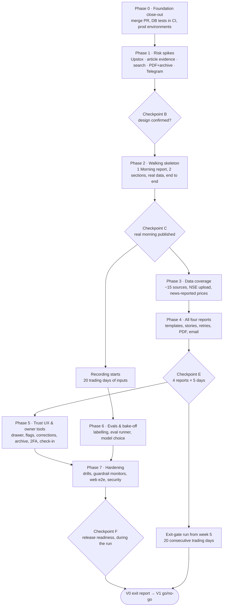

# Implementation and Testing Plan: Citebell V0

*Approved 14 Sep 2026; decisions in §10. Covers the work from the scaffold ([PR #1](https://github.com/kunalsmathur-gif/market-intel-console/pull/1)) to the V0 exit gate in PRD §10, with a lighter roadmap for V1 onward. Checklist: [todo.md](todo.md).*

## 1. Overview

V0 ("proof of trust") delivers four fact-checked reports every trading day (08:45, 12:15, 16:00, 20:00 IST) to the web app, Telegram and email. It uses about 15 curated sources, verification gate v1, a citation on every claim, "flag as wrong", a simple archive, and a Markets page built on chart widgets. Every fact and claim is stored from day one.

**Exit gate (PRD §10):** 20 trading days in a row with ≥ 95% of reports on time, zero unverified or wrong claims in spot checks, and a measured baseline for research time.

**Already done (scaffold):**
- Worker skeleton, with the publish gate, model router and run queue.
- Database schema, owner-only RLS and CI.
- Web app shell with magic-link sign-in.
- Private config repo, with 35 sources and draft prompts.

**How the plan is built:**
1. **Risky unknowns first.** Five time-boxed spikes answer the questions that could change the design. The most important: can the worker fetch publisher pages and find quotes on them?
2. **Then one thin vertical slice on real data.** One Morning report with two sections travels through every layer, from collection to Telegram.
3. **Then widen:** more sources, all four reports, trust features, evals and hardening.
4. **Human checkpoints:** you review at checkpoints A–F before the next phase starts.

## 2. Architecture decisions carried into the plan

| Decision | Source | Effect on the plan |
|---|---|---|
| Web app only reads; the worker holds every key | PRD §8.1 | No provider calls from Vercel. The Upstox login redirect needs a worker-side endpoint or another route (Spike 1.1). |
| No LangChain; one JSON model call per step | PRD §8.2 | Every AI step is a plain function, tested with recorded model outputs. |
| Numbers come from data, never from the model | PRD §8.12 | The writer outputs placeholders; code fills them from verified facts. |
| Gate rules are code and fail closed | PRD §7 | Built in the scaffold; each new claim type or rule adds tests first. |
| Upstox; manual NSE files via Telegram; private config repo | PRD v1.4 appendix | Telegram bot is needed early (upload and login prompt). |
| Direct Gemini key for production; OpenRouter for bake-off and backups | PRD §9.1, §8.12 | Default models are placeholders until the bake-off (Phase 6). |
| Precompute, then serve; Postgres queue; outbox for alerts | PRD §8.11, §8.7 | No Redis. Alerts are written in the publish transaction. |
| No staging environment | Cost (§9); approved 14 Sep 2026 | Production Supabase, Railway and Vercel, plus CI databases and replays. A worker `--no-notify` flag gives a shadow mode. |
| Sign-in: email magic link **and Google**, plus 2FA; owner-only | PRD §8.5; approved 14 Sep 2026 | Google sign-in is built in Phase 0 (Task 0.4). Enterprise SAML SSO stays a SaaS-stage feature. |
| Private config reaches Railway at startup | Task 0.3 | The worker downloads the private repo at a pinned commit, using a read-only token. No secrets are baked into the image, and each run records the config commit it used. |

## 3. Dependency graph

## 4. Phases and tasks

**Sizes:** XS = one change · S = 1–2 files · M = 3–5 files · L = split it.

**Estimates** are developer days for one developer using AI coding tools. Every task also meets the Definition of Done in §7.

### Phase 0: Foundation close-out (1.5–2.5 days)

#### Task 0.1: Merge the scaffold and protect `main`
- **Description:** Merge PR #1. Require a passing CI and a pull request before anything lands on `main`.
- **Acceptance:**
  - [ ] `main` contains the scaffold.
  - [ ] Branch protection requires the `worker`, `web` and `schema-contract` checks.
- **Verification:** `gh pr view 1` shows merged; a test push straight to `main` is rejected.
- **Dependencies:** none · **Owner:** you merge; I set protection only with your go-ahead · **Size:** XS

#### Task 0.2: Database tests in CI
- **Description:** Turn the scratch schema check (24 checks) into pytest tests. They run against a Postgres service container with stubbed Supabase `auth` and `storage` schemas.
- **Acceptance:**
  - [ ] A `db` CI job runs the migration, then the queue, append-only, constraint and RLS tests.
  - [ ] The same tests run locally against pgserver.
- **Verification:** CI `db` job green; a deliberately broken policy fails it.
- **Dependencies:** 0.1
- **Files:** `infra/supabase/tests/{conftest.py,stubs.sql,test_schema.py}`, `.github/workflows/ci.yml`
- **Size:** M

#### Task 0.3: Production environments
- **Description:** Stand up the three production services.
  - **Supabase (Mumbai):** apply the migration, turn off sign-ups, set redirect URLs, add your email to `allowed_users`.
  - **Vercel:** project with root `apps/web`.
  - **Railway:** worker service from `apps/worker/railway.json`, with an idle scheduler. At startup the worker downloads the private config repo at a pinned commit, using a read-only fine-grained token.
  - **Uptime monitor:** add a check.
- **Acceptance:**
  - [ ] You can sign in on the production URL.
  - [ ] `citebell-worker check` passes on Railway and prints the private config commit.
  - [ ] A heartbeat ping is visible in the monitor.
- **Verification:** screenshots of sign-in and Today; Railway logs; tests for the config download (bad token, bad ref, unsafe archive paths).
- **Dependencies:** 0.1 · **Owner:** you create accounts and keys by following `docs/setup/production.md`; I write the config, code and guide · **Size:** M

#### Task 0.4: Sign in with Google
- **Description:** A "Continue with Google" button on the login page, using Supabase's Google provider. It lands on the same `/auth/confirm` route as the magic link and uses the same owner allowlist. A failed or refused sign-in returns to the login page with a clear message.
- **Acceptance:**
  - [ ] Your Google account signs in to the same owner account as your magic link.
  - [ ] Any other Google account is refused, or sees nothing because RLS applies.
  - [ ] Errors on the login page explain what to do next.
- **Verification:** lint, typecheck and build; a browser check of the login page; a real Google sign-in on production at Checkpoint A.
- **Dependencies:** 0.3 for production; you create the Google OAuth client · **Size:** S

**Checkpoint A:** production sign-in works with the magic link and with Google; the worker is deployed and idle; CI (including `db`) is green.

### Phase 1: Risk spikes (3–4 days, time-boxed)

Each spike ends in a short decision record, `docs/decisions/NNN-*.md`, with evidence. Spike code is thrown away unless it's clean enough to keep.

#### Spike 1.1: Upstox login and data (≤ 1 day)
- **Questions:**
  1. Which daily login flow works without the web app holding keys? Options: an OAuth redirect to a small worker endpoint, a login link sent by Telegram, a token-request/approval flow if Upstox offers one, or the longer-lived read-only token.
  2. Does the token really expire at 03:30 IST?
  3. What are the instrument keys and response shapes for Nifty 50, Bank Nifty, Fin Nifty, India VIX, the option chain, MCX crude and gold, and NSE USD/INR futures?
  4. What are the rate limits?
- **Acceptance:**
  - [ ] Decision record naming the login flow.
  - [ ] Recorded sample responses for each instrument.
  - [ ] Documented limits and expiry behaviour.
- **Dependencies:** your Upstox developer app (API key, secret, redirect URL)

#### Spike 1.2: Article evidence feasibility (≤ 1.5 days), highest risk
- **Question:** The gate needs "HTTP 200 and the quote is on the page". For each T2 source in `sources.toml`:
  - Is there an RSS feed?
  - Does an honest automated fetch of an article page return 200, or is it blocked, paywalled or JavaScript-only?
  - Can the publish time be extracted?
  - What share of ten recent articles yield a matching quote?
  - What do the site's terms and robots rules say?
- **Acceptance:**
  - [ ] Per-source table: usable / partial / not usable, with evidence.
  - [ ] Go/no-go on the "quote found on page" rule.
  - [ ] If fewer than ~10 sources are usable, a proposed rule change (for example, accepting the quote from the publisher's RSS summary). The rule change needs your decision and a PRD update.

#### Spike 1.3: Search for wires and pre-market prices (≤ 0.5 day)
- **Question:** For 20 real queries (Reuters, AP or Bloomberg stories; GIFT Nifty and US futures quotes), compare Gemini's Google Search grounding with Exa and Parallel:
  - Are original publisher URLs returned, or redirect links?
  - Can results be filtered to the allow-list, and how fresh are they?
  - Are publish times returned, and what does each query cost?
- **Acceptance:** decision record choosing the provider and the allow-list filter design.

#### Spike 1.4: PDF, archive and email (≤ 0.5 day)
- **Question:**
  - WeasyPrint or headless Chromium for PDFs inside the worker Docker image? It must handle Fira fonts, ₹ Indian digit grouping, and render time and file size.
  - Wayback Save Page Now: latency, limits and account keys.
  - Resend: can it send to your address without a custom domain?
  - Telegram `sendDocument`: can it deliver the PDF?
- **Acceptance:** decision record, plus a sample PDF rendered in Docker from a fixture report.

#### Spike 1.5: Telegram bot mode (≤ 0.5 day)
- **Question:** Long polling from the worker, or a webhook? Can the bot receive a document (the NSE file) and commands (`/status`, `/login`), and lock to your chat id?
- **Acceptance:** decision record; the bot answers `/status` from Railway.
- **Dependencies:** your bot token from BotFather.

**Checkpoint B (your review):**
- Spike findings.
- Confirm or revise the evidence rules, the source list, the login flow, and which Flows items have a permitted source (bulk and block deals, insider trades).
- I update the PRD and this plan before Phase 2.

### Phase 2: Walking skeleton (6–8 days)

**Goal:** one real Morning Insights report with two sections, published end to end.
- **"India setup":** Nifty 50, Bank Nifty and India VIX from Upstox (primary data).
- **"Domestic triggers":** news events from three RSS publishers (verified).

#### Task 2.1: Collector framework
- **Description:** A base HTTP client per source, with:
  - timeouts, retries with backoff, and a circuit breaker;
  - a `raw_responses` cache keyed by request, with a TTL and a content hash;
  - a replay mode that serves cached responses for a run;
  - per-source health counters.
- **Acceptance:**
  - [ ] A failing source affects only its own collector.
  - [ ] Cached responses make a run replayable.
  - [ ] The breaker opens and closes as configured.
- **Verification:** respx tests for retry, breaker and cache hit/miss; a replay test.
- **Dependencies:** 0.2
- **Files:** `apps/worker/src/citebell_worker/sources/{base.py,cache.py,health.py}`, tests
- **Size:** M

#### Task 2.2: Upstox client and daily login
- **Description:** Implement the flow chosen in Spike 1.1:
  - encrypted token storage (new migration `broker_tokens`; key in worker env);
  - a Telegram login prompt at 07:00 IST;
  - if the token is missing or expired, sections that need Upstox are withheld with the reason "Upstox login needed".
- **Acceptance:**
  - [ ] Login once, and data calls succeed until expiry.
  - [ ] An expired token produces a withheld section, not a crash.
- **Verification:** tests for token expiry and the missing-token path; a manual login on a trading morning.
- **Dependencies:** 2.1, 1.1, 1.5 · **Size:** M

#### Task 2.3: India market facts
- **Description:** Upstox quotes become `market_facts` for Nifty 50, Bank Nifty and India VIX (last and previous close). `as_of` comes from the exchange timestamp. Each fact is T1 feed evidence.
- **Acceptance:**
  - [ ] Facts stored with unit, as-of time and source.
  - [ ] Timezone handled correctly.
- **Verification:** parser tests on the recorded responses from Spike 1.1.
- **Dependencies:** 2.2 · **Size:** S

#### Task 2.4: RSS collector
- **Description:** Fetch three usable feeds (from Spike 1.2) into `articles`:
  - title, canonical link, published time and fingerprint; no body stored;
  - dedupe by canonical URL;
  - syndication grouping v1 (wire byline plus near-identical titles).
- **Acceptance:**
  - [ ] Duplicate links are stored once.
  - [ ] Wire copies share a syndication group.
- **Verification:** parser tests with fixtures from the private repo; canonicalization tests.
- **Dependencies:** 2.1, 1.2 · **Size:** M

#### Task 2.5: Article checker
- **Description:** Fetch the page in memory only. Record the HTTP status, extract the publish time (meta tags or JSON-LD), and match the quote (normalised quotes, dashes and whitespace). Compute the fingerprint and request a Wayback capture in the background.
- **Acceptance:**
  - [ ] Page text is never persisted.
  - [ ] Quotes are matched exactly after normalisation.
  - [ ] Paywalled partial text is marked as such.
- **Verification:** tests on synthetic HTML fixtures, including paywall and JavaScript-only pages; a grep test that no article text reaches the database.
- **Dependencies:** 2.4, 1.2, 1.4 · **Size:** M

#### Task 2.6: Extract step
- **Description:** A model call with the `extract` prompt and a JSON schema returns claims (type, text, value, unit, as-of, author, quote) mapped to `Claim` plus article `Evidence`. Code rejects any value that doesn't appear in the source text.
- **Acceptance:**
  - [ ] Output validates against the schema.
  - [ ] Invented numbers are dropped and logged.
- **Verification:** tests with recorded or fake model outputs, including a number the model invented.
- **Dependencies:** 2.5 · **Size:** M

#### Task 2.7: Verify step and corroboration
- **Description:** For each claim:
  - gather candidate evidence: other articles in the time window, plus T1 feed facts for numbers;
  - call the `verify` prompt once per claim–source pair (supports / contradicts / insufficient);
  - then run the gate.
- **Acceptance:**
  - [ ] A contradiction withholds the claim.
  - [ ] "Insufficient" never counts as support.
  - [ ] Every decision is stored with its reasons.
- **Verification:** tests with fake model outputs for each verdict; tests for gate integration.
- **Dependencies:** 2.6, 2.3 · **Size:** M

#### Task 2.8: Writer and renderer
- **Description:** The `write` prompt returns blocks with claim ids and `{{placeholders}}`. Code then enforces three rules:
  - every sentence cites published claims;
  - placeholders resolve only to verified facts, formatted with ₹ Indian grouping, points and signs;
  - an advice-language blocklist applies.

  An unresolved placeholder or uncited sentence withholds the section with a reason.
- **Acceptance:**
  - [ ] No number in the output comes from the model.
  - [ ] Advice phrases are blocked.
- **Verification:** renderer tests (placeholder resolution, Indian grouping, withheld paths); advice detector tests.
- **Dependencies:** 2.7 · **Size:** M

#### Task 2.9: Publisher
- **Description:** One transaction writes the claims, evidence, report (v1), sections, section–claim links and the `report_ready` outbox row. It's idempotent on the run key. The runner's real steps replace the scaffold's gate-only list for the skeleton report.
- **Acceptance:**
  - [ ] A retried run never publishes twice.
  - [ ] A crash mid-publish leaves nothing half-written.
- **Verification:** integration test against Postgres in CI (the `db` job), with a fault injected mid-transaction.
- **Dependencies:** 2.8, 0.2 · **Size:** M

#### Task 2.10: Report page in the web app
- **Description:** A `/reports/[type]/[date]` page showing sections, citation superscripts `[n]`, a numbered source list (publisher, tier, time, link), badges, as-of chips and withheld banners. The Today cards link to it.
- **Acceptance:**
  - [ ] Every rendered claim has a working citation.
  - [ ] Withheld sections show the reason and retry time.
  - [ ] Works at 375 px.
- **Verification:** typecheck and build; a manual check against seeded data with screenshots. Automated end-to-end tests arrive in Task 7.3.
- **Dependencies:** 2.9 · **Size:** M

#### Task 2.11: Notifier
- **Description:** An outbox dispatcher in the worker sends Telegram messages with retries, backoff and `SKIP LOCKED` claiming, and records delivery status. A `--no-notify` flag gives a shadow mode.
- **Acceptance:**
  - [ ] A report-ready alert arrives within 60 seconds of publishing.
  - [ ] Never sent twice, even with two dispatchers running.
- **Verification:** respx tests for retry and dedupe; a concurrency test on Postgres.
- **Dependencies:** 2.9, 1.5 · **Size:** S

**Checkpoint C (your review):** the skeleton report publishes by 08:45 on a real trading morning in production, with a Telegram alert and working citations. You spot-check every claim. **Recording starts the next trading day (Task 3.1).**

### Phase 3: Data coverage (5–6 days)

#### Task 3.1: Day recording
- **Description:** Every scheduled run saves a replayable bundle to the private repo's `evals/days/`: raw feed responses, article metadata, quotes of ≤ 25 words, and model inputs and outputs.
- **Acceptance:** replaying a bundle with its recorded model outputs reproduces the same gate decisions.
- **Verification:** round-trip replay test.
- **Dependencies:** 2.9 · **Size:** M

#### Task 3.2: Global official data
- **Description:** FRED series (US index closes, US 10-year yield) and US Treasury yields.
- **Acceptance:** facts with as-of dates.
- **Verification:** parser tests.
- **Dependencies:** 2.1 · **Size:** S

#### Task 3.3: Crypto
- **Description:** CoinGecko Demo (BTC, ETH, dominance) plus a second public exchange price, whose terms need checking.
- **Acceptance:** two independent feeds agree within tolerance, or the item is withheld.
- **Verification:** parser and tolerance tests.
- **Dependencies:** 2.1 · **Size:** S

#### Task 3.4: Official India sources
- **Description:** NSDL FPI daily data, the FBIL reference rate, and RBI, SEBI and PIB releases as T1 news events.
- **Acceptance:** each is parsed with its publish time.
- **Verification:** parser tests.
- **Dependencies:** 2.1, 2.4 · **Size:** M

#### Task 3.5: Upstox derivatives and India-traded commodities
- **Description:**
  - From the option chain: PCR, max pain (computed), put base and call wall.
  - MCX crude and gold, and NSE USD/INR futures.
  - The futures premium.
  - Nifty 50 breadth, using a constituent list kept by hand in the private repo.
- **Acceptance:**
  - [ ] Computed values have unit tests on known chains.
  - [ ] Advances + declines + unchanged = 50.
- **Verification:** calculation tests on recorded chains.
- **Dependencies:** 2.2 · **Size:** M

#### Task 3.6: NSE file upload via Telegram
- **Description:** You send the NSE file to the bot. The worker then:
  - stores it in the `uploads` bucket and a `manual_uploads` row;
  - parses FII/DII provisional figures, participant-wise OI and the ban list into T1 manual facts, then queues the Flows run;
  - rejects the wrong file, date or totals with a bot reply.
- **Acceptance:**
  - [ ] FII + DII = combined, to ₹0.01 Cr.
  - [ ] The same file twice is a no-op.
- **Verification:** parser tests on private fixtures; bad-file tests.
- **Dependencies:** 1.5, 2.1 · **Size:** M

#### Task 3.7: Remaining publishers, search and GDELT
- **Description:** Bring RSS up to about 15 usable sources, add the wire search collector chosen in Spike 1.3, and GDELT for spotting events (never cited).
- **Acceptance:** each source has a parser test and a terms note in `sources.toml`.
- **Verification:** parser tests; a source health report after 3 days.
- **Dependencies:** 2.4, 1.3 · **Size:** M

#### Task 3.8: News-reported global prices
- **Description:** GIFT Nifty, S&P and Nasdaq futures, Nikkei, Hang Seng, Kospi, Brent and WTI from at least two independent pre-market articles, shown with both times.
- **Acceptance:** rounded or conflicting values (e.g. "near $109" vs $108.31) are withheld.
- **Verification:** trap tests.
- **Dependencies:** 3.7, 2.7 · **Size:** M

#### Task 3.9: Event calendar
- **Description:** A yearly calendar file in the private repo: RBI, Fed, ECB, BoJ, MoSPI and BLS dates, plus expiry dates from exchange circulars. FRED release dates and the NSE holiday list are loaded alongside it.
- **Acceptance:** "today's calendar" facts exist for every trading day in the file.
- **Verification:** loader tests; a check that every holiday in the calendar year is listed.
- **Dependencies:** 2.1 · **Size:** S

**Checkpoint D:** all sources collect daily in production, source health is visible, and recording has run for 5+ days with no unhandled parser failures.

### Phase 4: All four reports (6–7 days)

#### Task 4.1: Report template spec
- **Description:** Report templates as code: sections, required facts and claim types, a freshness window per section, fallbacks. This replaces the scaffold's single 24-hour window.
- **Acceptance:** every PRD §7 field maps to a section and a data source, or is explicitly deferred.
- **Verification:** template validation tests.
- **Size:** S

#### Task 4.2: Story grouping
- **Description:** Group articles by title similarity plus a quick check with the `classify` model; store `stories` and `story_articles`; show "+N similar".
- **Acceptance:**
  - [ ] The same event from eight outlets becomes one story.
  - [ ] Same topic but a different event stays separate.
- **Verification:** labelled fixture pairs.
- **Size:** M

#### Task 4.3: Morning Insights, all sections
- **Description:**
  - Global opening check; India setup and flows; data outlook.
  - Three ranked takeaways.
  - Opening cue, support and key risk, phrased only as computed levels or attributed views.
  - News sections and today's calendar.
- **Acceptance:** the §7 contents are present or withheld with a reason; the read is ≤ 8 minutes.
- **Verification:** replay on recorded days; your review.
- **Size:** M

#### Task 4.4: Mid-day Markets, with "what changed since 08:45"
- **Description:** Diff rows tagged UP, DOWN, NEW or FIXED against the morning report.
- **Acceptance:** the diff is correct on recorded morning/mid-day pairs.
- **Verification:** diff tests.
- **Size:** M

#### Task 4.5: End-of-day Insights
- **Description:** Close badge, three ranked drivers, sector heat map data, closing OI and PCR, VIX, tomorrow's calendar.
- **Acceptance:** drivers are ranked by index-point contribution if index weights are available; otherwise the fallback ranking is documented.
- **Verification:** replay; your review.
- **Size:** M

#### Task 4.6: Institutional Flows
- **Description:**
  - Triggered by the upload.
  - 20-session trend from stored facts; participant OI; NSDL cross-check at T+1.
  - Next-day setup; US pre-market and crypto check.
  - A late alert if nothing is uploaded by 19:45.
  - Bulk and block deals and insider trades only if Checkpoint B found a permitted source; otherwise deferred to V1.
- **Acceptance:** ₹ values match across the report and the Today page.
- **Verification:** replay; late-path test.
- **Size:** M

#### Task 4.7: Publish as you go, retries and versions
- **Description:** Sections go live as they pass. Withheld sections are retried until the deadline, with a `retry_at`. A late alert fires at the deadline, and a later completion creates a new version.
- **Acceptance:** a slow source delays only its own section.
- **Verification:** fault-injection tests.
- **Size:** M

#### Task 4.8: PDF and citation pack
- **Description:** Render the PDF (method from Spike 1.4) and a CSV + JSON citation pack. Upload both to the `reports` bucket; the web app offers short-lived signed links.
- **Acceptance:**
  - [ ] PDF content matches the web page.
  - [ ] The citation pack has every claim's sources and verdict.
- **Verification:** snapshot test of the pack; a PDF render in CI Docker.
- **Size:** M

#### Task 4.9: Email delivery
- **Description:** A Resend "report ready" email with a summary and the PDF link or attachment.
- **Acceptance:** arrives within 60 seconds; never sent twice.
- **Verification:** respx tests; one real email.
- **Size:** S

**Checkpoint E (your review):** all four reports publish on schedule for 5 consecutive trading days. You review the layout and content and we agree a fix list. **The exit-gate run can start here (see Open question 1).**

### Phase 5: Trust features and owner tools (5–6 days)

#### Task 5.1: Fact-check drawer (W3)
- **Description:** A drawer showing the claim, the rule applied and its badge; the number check across sources; each source's tier, time, quote and archive link; and the collected → verified → published timeline.
- **Acceptance:** opens from any citation; keyboard accessible; works as a bottom sheet at 375 px.
- **Size:** M

#### Task 5.2: Flag as wrong and corrections
- **Description:** A flag triggers a Telegram alert and a re-verify job (≤ 30 minutes).
  - **Confirmed wrong:** a correction row, a replacement claim, a new report version, a banner and changelog, and a correction alert.
  - **Otherwise:** the flag is dismissed with a reason.

  Confirmed flags are exported as golden test cases.
- **Acceptance:** the whole loop completes in ≤ 30 minutes; nothing is edited in place.
- **Size:** M

#### Task 5.3: Archive and corrections log
- **Description:** Reports by date and type, Postgres full-text search, report versions, and a corrections log page.
- **Acceptance:** any past report and its corrections can be found in 2 clicks.
- **Size:** M

#### Task 5.4: Markets page on chart widgets
- **Description:** Region tabs with embedded third-party chart widgets, with attribution per the widget's terms. Citebell data isn't redistributed.
- **Acceptance:** no horizontal scroll; a table fallback link.
- **Size:** S

#### Task 5.5: Sign-in hardening
- **Description:**
  - TOTP 2FA with Supabase MFA, required after both magic-link and Google sign-in.
  - `is_owner()` requires `aal2`.
  - 30-day session; sign-in history.
  - Recovery: check whether Supabase offers recovery codes. If not, enrol two TOTP factors, which changes PRD §8.5.
- **Acceptance:** data is unreadable without 2FA, verified by an RLS test.
- **Size:** M

#### Task 5.6: Daily check-in and ratings
- **Description:** A one-tap check-in (minutes of outside research, sole-source yes/no), a per-report usefulness rating, and a "missed story" button.
- **Acceptance:** exit-gate metrics can be queried.
- **Size:** S

#### Task 5.7: Operations page
- **Description:** Runs (status, duration against the deadline, cost), source health, month-to-date spend against budget, and open flags.
- **Acceptance:** you can see why any run was late or withheld.
- **Size:** S

### Phase 6: Evals and model bake-off (4–5 days, plus your labelling)

#### Task 6.1: Labelling tool
- **Description:** A minimal owner page or CLI to label recorded claims, claim–source pairs, impact tags and top-3 picks. Labels are written as JSONL to the private repo.
- **Acceptance:** about 300 claims can be labelled in ≤ 8 hours.
- **Dependencies:** 3.1 · **Size:** S

#### Task 6.2: AI pipeline eval runner
- **Description:** Scores:
  - extraction precision and recall;
  - verify accuracy, with 0 wrong accepts on the critical traps;
  - faithfulness (every sentence backed by a claim);
  - format validity and the advice detector;
  - latency and cost from traces.

  Runs as a CLI plus a manual `workflow_dispatch` job with a cost cap, and nightly.
- **Acceptance:** a scored markdown report per run.
- **Dependencies:** 6.1 · **Size:** M

#### Task 6.3: Bake-off
- **Description:** The PRD §8.12 shortlist (via OpenRouter) and a direct Gemini key, on the same sets, 3 runs each. Two judge models from different vendors, calibrated on 50 of your labels. Pick the cheapest model per step that clears every bar, plus a backup from another vendor.
- **Acceptance:** decision record with per-step models; production env updated only after replay passes.
- **Dependencies:** 6.2 and about 20 recorded, labelled days · **Size:** M

#### Task 6.4: Replay suite
- **Description:** A nightly replay of every recorded day using recorded model outputs (deterministic), and a weekly live-model replay on a sample, with a cost cap.
- **Acceptance:** any change in gate decisions is reported with a diff.
- **Size:** S

### Phase 7: Hardening (4–5 days)

#### Task 7.1: Failure drills
- **Description:** Inject faults into replays: provider timeout, HTTP 429, malformed NSE file, model refusal or overload, database connection drop, missing Upstox token.
- **Acceptance:** each drill produces the documented withheld state or alert, and never a double publish.
- **Size:** M

#### Task 7.2: Guardrail monitors (PRD §16)
- **Description:**
  - Alert when one outlet has more than 30% of a report's citations.
  - Recheck dead links at +7 days and fall back to the archive copy.
  - Block publishing when an as-of time is stale.
  - Alert at 80% of the cost budget.
  - Purge raw responses after 90 days.
  - Count advice leakage.
- **Acceptance:** every §16 guardrail has an automated check or a documented manual one.
- **Size:** M

#### Task 7.3: Web end-to-end tests
- **Description:** Playwright against a local Supabase in CI (Docker on the runner), with seeded data and sign-in via an admin-generated link. Journey: Today → report → drawer → flag.
- **Acceptance:** the journey passes on 375 px and 1440 px viewports.
- **Size:** M

#### Task 7.4: Accessibility and performance
- **Description:** axe-core (0 serious issues) and Lighthouse CI on mobile (LCP < 2.5 s) for Today and a report page.
- **Acceptance:** both run in CI and block regressions.
- **Size:** S

#### Task 7.5: Security and release pipeline
- **Description:**
  - Secret scanning (gitleaks), `pip-audit` and `npm audit`, Dependabot.
  - Supabase migrations applied from CI with manual approval.
  - Auto-deploy on `main` for Railway and Vercel; rollback notes; check database backups on your plan.
- **Acceptance:** a leaked test secret fails CI; a migration can't reach production unapproved.
- **Size:** M

#### Task 7.6: Runbook
- **Description:** Daily operations (Upstox login, NSE upload), severity levels (Sev-1 per §16), pulling a claim, rotating keys, and replaying a day.
- **Acceptance:** you can do each procedure from the document alone.
- **Size:** S

**Checkpoint F (release readiness):** all suites green, drills pass, runbook done, costs within §9, you sign off.

### Phase 8: Exit-gate run and V0 exit (20 consecutive trading days)

#### Task 8.1: Gate run operations
- **Daily:**
  - Log on-time status.
  - Run the spot-check protocol (§5.6).
  - Do the check-in.
- **Weekly:** a 30-minute review of flags, withheld reasons, source health and cost.
- **Fixes:** shipped as pull requests with replay evidence.
- **Counter:** a confirmed wrong or unverified claim resets it.

#### Task 8.2: V0 exit report
- **Contents:** on-time %, spot-check results, corrections, research-time baseline against Citebell, cost against §9, open risks.
- **Output:** a V1 go/no-go decision.

## 5. Testing strategy

### 5.1 Test levels

| Level | What it proves | Tools | Where it lives |
|---|---|---|---|
| Unit | Each function's rules: gate, tolerances, schedule, renderer, calculations (PCR, max pain, breadth) | pytest, respx; Vitest for web utilities | `apps/*/tests` |
| Parser / contract | Each source's real response still parses; a format change fails loudly | pytest with recorded responses | API JSON in the public repo; publisher HTML/RSS and NSE files in the private repo |
| Database | Migration applies; RLS, append-only guards, queue and outbox semantics | pytest + Postgres service with Supabase stubs | `infra/supabase/tests` |
| Schema contract | The web app's TypeScript types match the Python models | export + json2ts + `git diff` | CI (exists) |
| Pipeline integration | A recorded day → collect → extract → verify → gate → write → publish into Postgres, with recorded model outputs | pytest + replay bundles | `apps/worker/tests/integration` |
| AI pipeline evals | Model steps are accurate and faithful on labelled data | eval runner (Task 6.2) with live models | `evals/` (harness) + private repo (data) |
| Replay and failure drills | Deadlines and fail-closed behaviour under faults | replay + fault injection | CI nightly and weekly |
| Web end-to-end | Your journeys work in a browser on both viewports | Playwright + Supabase local | `apps/web/e2e` |
| Accessibility and performance | 0 serious axe issues; mobile LCP < 2.5 s | axe-core, Lighthouse CI | CI |
| Acceptance | Reports are right and useful | your spot checks, check-ins, ratings | production |
| Production monitors | Guardrails hold every day | §16 checks, alerts, heartbeat | worker + ops page |

### 5.2 When each suite runs

| Trigger | Suites | Blocks merge? |
|---|---|---|
| Every pull request | lint, types, unit, parser, database, schema contract, pipeline integration (recorded outputs), web build, secret scan | Yes |
| Change to prompts, models or templates | + AI pipeline evals (manual dispatch with a cost cap; results posted to the PR) | Yes, for model steps |
| Nightly | replay of all recorded days, dead-link recheck, dependency audit | Opens an issue on regression |
| Weekly | failure drills, live-model replay sample, web e2e on production data (read-only) | Opens an issue |
| Every run in production | data sanity checks, gate, guardrail monitors, cost tracking | Withholds or alerts |
| Daily during the gate run | spot checks, check-in | Resets the gate counter on a confirmed error |

### 5.3 Test data policy

- **Public repo:** code, synthetic fixtures, and API responses that contain no publisher text.
- **Private repo:** publisher HTML and RSS fixtures, NSE files, recorded days, golden sets, trap cases.
- **Quotes stay ≤ 25 words** everywhere; article bodies are never stored, even in fixtures.
- **CI jobs that need private data** check out the private repo with a read-only deploy key and run only on branches in this repo, never on pull requests from forks (the repo is public).

### 5.4 Coverage and quality bars

- **Coverage:** ≥ 90% line coverage on gate, verification, renderer and publisher code (PRD §8.10).
- **Static checks:** mypy strict, ruff, eslint and tsc with no errors.
- **Test-first rules:** every bug fix adds a failing test first. Every confirmed "flag as wrong" becomes a golden case.

### 5.5 PRD §8.10 eval suites → tasks

| Suite | Implemented by |
|---|---|
| UX | 7.3 (end-to-end), 7.4 (axe, Lighthouse), 5.6 (timed plan check-in), fortnightly "trade plan in ≤ 15 min" session with you |
| Code | CI today, plus 0.2, parser tests in 2.x/3.x, 7.5 |
| Data sanity | 3.5 (breadth sum), 3.6 (FII + DII = combined), 2.3/3.2 (as-of, no future timestamps), 3.9 (holidays), unit checks in 2.8 |
| Data quality | 2.1 (source health), 3.7 (health report), 7.2 (freshness, concentration), 5.7 (ops page) |
| AI pipeline | 2.6–2.8 (code checks), 6.2 (eval runner), 6.3 (bake-off) |
| System stability | 6.4 (replay), 7.1 (drills), heartbeat from 0.3 |
| Cost | traces from 2.9, 7.2 (80% alert), 5.7 (spend view) |

### 5.6 Spot-check protocol (gate run)

1. **Each trading day,** the ops page samples 10 published claims per report, weighted toward numbers and news-reported values. It also lists every withheld section.
2. **You open each sampled claim's citation** and mark it correct, wrong or unverifiable, taking about 10–15 minutes a day.
3. **Wrong or unverifiable:** a Sev-1 per §16. Pull the claim, issue a correction, add a regression case, reset the gate counter.
4. **Results are stored** (small `spot_checks` table) and summarised in the exit report.

### 5.7 Environments

| Environment | Purpose | Notes |
|---|---|---|
| Local (your Windows PC) | Development, unit and database tests | No Docker. Postgres tests via pgserver. Windows Application Control blocks some compiled extensions: install mypy with `--no-binary`, and set `PSYCOPG_IMPL=python` with libpq on PATH. |
| CI (GitHub Actions, Linux) | All automated suites | Postgres service; Supabase CLI local stack for web e2e; PDF render in Docker |
| Production | The real product | One Supabase project (Mumbai), Railway, Vercel. `--no-notify` shadow mode for risky changes. **No staging**, pending your approval. |

## 6. Timeline

| Week | Work | Checkpoint |
|---|---|---|
| 1 | Phase 0, Phase 1 spikes | A, B |
| 2–3 | Phase 2 walking skeleton | C (end of week 3); recording starts |
| 3–4 | Phase 3 data coverage | D |
| 4–5 | Phase 4 all four reports | E; **gate run starts** |
| 5–6 | Phase 5 trust features; you label recorded days | |
| 6–7 | Phase 6 evals and bake-off; Phase 7 hardening | F |
| 5–10 | Exit-gate run, 20 trading days | V0 exit report |

**Estimate:** about 35–44 developer days, above the PRD §9.2 range of 26–36. You chose to keep the full scope (§10). The difference comes from:
- the spikes (3–4 days);
- trust features the PRD lists for V0: fact-check drawer, flag and correction loop, archive, 2FA;
- Google sign-in;
- the web end-to-end, accessibility and performance suites.

**Changes during the gate run:** every change needs replay evidence, and a model switch from the bake-off needs a passing replay before it reaches production.

**Calendar risks:**
- NSE holidays in the October–November festival season reduce trading days; the 20-day count uses the real NSE holiday list.
- US daylight saving ends 1 Nov 2026 and Europe's on 25 Oct 2026. The US close then moves from 01:30 to 02:30 IST, so market-clock tests must cover both dates.

## 7. Definition of Done (every task)

- [ ] Acceptance criteria met, with evidence in the pull request: test output, screenshots or logs.
- [ ] Tests added: failing first for fixes; parser tests use recorded responses.
- [ ] CI green: lint, types, unit, database, schema contract, build.
- [ ] No secrets, article bodies or quotes over 25 words committed. Brand scan for the reference-template business name and registration number returns zero hits.
- [ ] New data source: terms checked and noted in `sources.toml`.
- [ ] Prompt or model change: eval results attached.
- [ ] Docs updated (README, decision record, runbook) when behaviour or operations change.
- [ ] One task per pull request; I stop at each checkpoint for your review.

## 8. Risks and mitigations

| Risk | Impact | Mitigation |
|---|---|---|
| Publisher pages block automated fetches, so quotes can't be checked and most news is withheld | High | Spike 1.2 first; a rule change needs your decision; lean more on T1 sources and wires via search |
| Upstox daily login is fragile, or the redirect needs a public endpoint | High | Spike 1.1; clear "login needed" withheld state; Telegram prompt at 07:00; Kite Connect fallback (§9.5) |
| Search grounding returns redirect links or can't be filtered by domain | Medium | Spike 1.3; Exa or Parallel as alternatives |
| Flash-Lite models miss the verification bars | Medium | Bake-off; stronger model only for the verify step (§9.5 trigger) |
| Too few labelled days before the bake-off | Medium | Recording starts at Checkpoint C; you label in weeks 5–6 |
| Scope creep from the wireframes (W1–W11 are V1 scope) | Medium | V0 builds only the §10 V0 list; the rest goes to the V1 backlog |
| Timing drift (DST, holidays, late NSE files) | Medium | Market-clock tests for both DST dates; holiday file; late alerts |
| Cost overrun | Low | Per-run cost in traces; 80% budget alert; cheaper models for non-critical steps |
| No staging environment | Low–Medium | Replays, `--no-notify` shadow mode, migrations with manual approval |

## 9. Roadmap after V0 (planned at the V0 exit)

| Phase | Outline | Starts when |
|---|---|---|
| V1 · Console | Full W1–W10 screens; story clustering UI; second-feed reconciliation; derivatives panel; calendars; verified breaking alerts (≤ 5/day); web push; paid global price feed if its §9.5 trigger fires | V0 exit gate passed |
| V2 · Analyst | Ask Citebell over verified claims (RAG), story timelines, trade journal, weekly review | V1 metrics met (research ≤ 15 min, usefulness ≥ 4.2) |
| V3 · Co-pilot + SaaS beta | Accounts, plans, Razorpay, licensed data, legal review of SEBI rules | V2 decision-linkage ≥ 70% |

Each phase gets its own plan in this format when its predecessor exits.

## 10. Decisions (14 Sep 2026)

1. **Gate run starts at Checkpoint E (week 5)** and overlaps the remaining build. Every change during the run needs replay evidence.
2. **Nothing moves to V1.** The full plan stays in scope, at about 35–44 developer days.
3. **No staging environment.** Production, plus CI replays and a `--no-notify` shadow mode.
4. **Google sign-in is in V0**, alongside the magic link, with 2FA (Tasks 0.4 and 5.5). Enterprise SAML SSO waits for the SaaS stage.
5. **Cadence:** one task per pull request, merged by you. I stop at each checkpoint (A–F). To be revisited when you want.
